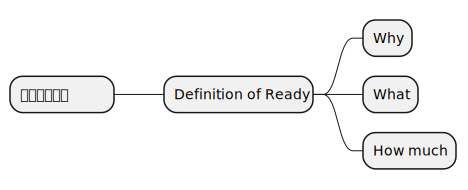
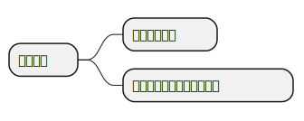
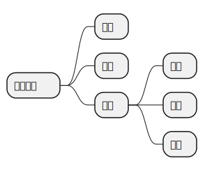
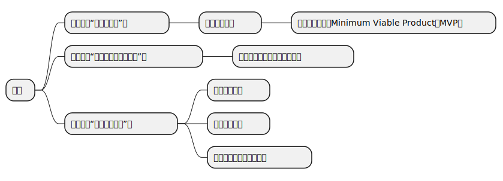
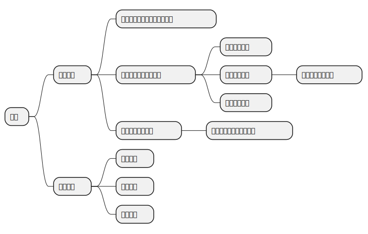

> 问题就是事物的矛盾。事物的矛盾就是以问题的形式表现出来的。主要的困难不是答案，而是问题。 
> — 毛泽东《矛盾论》

- Why：为什么做，计划的缘由、前景
- What：做什么，计划的内容
- When：什么时候做，计划实施的时间范围
- How：怎么做，实施方法
- Where：在哪做，计划的实施场所
- Who：谁去做
- How much：需要多少资源/预算

“做什么产品”关注的是Why，What，和How much。

“做什么产品”这个问题是贯穿始终且持续调整的：

- 通过产品探索（Product Discovery）确定产品的初始需求。
- 通过不断的“积小胜为大胜”调整产品战略直至取得商业成功。

而敏捷及其方法论，讲的就是如何“积小胜为大胜”。

> “失败是成功之母”这句话我是不大同意的。你想想，失败一次，再来，然后再失败，哪还有勇气，哪还有机会，哪还有能力去成功？应该是积小胜为大胜，积累一个一个的小成功。当然，这中间可能有失败，失败可以有很多，但绝对不能致命。从量上来讲，成功至少要占 51%，失败的时候少于 49%，做到这样，一个一个的小成功，会让人逐步地有信心。所以一开始目标不要太大，定小目标，你把它完成之后，可以再做一个，然后再做一个，只要大方向不受影响，即使过程中遭到挫败了，继续做下去，也还具备成功的条件。要积累经验，积累小胜，小胜多了，就是成功。 
> — 王石

<!--
参考：
https://www.zhihu.com/question/569725359/answer/3379780270
https://www.zhihu.com/question/523566521/answer/2709008781
-->

你想达到一个目的，一定要做和这个目的指向性一致的事情，然后疯狂地执行，快速试错，并且在做的过程中，控制成本，多实践，多迭代，控制风险。

成功其实很简单，只需要六步：

> 自我定位—设定目标—制定策略—执行反馈—调整行动—最终完成

把这六步其实就是PDCA(Plan Do Check Act)的变体。



你有什么能力，你的团队擅长干什么，你拥有的生产系统能干什么。



什么是目标？「我想考北大」这不是目标，说得好听点，叫想法、愿望。
你立下新年的目标「我想减肥，我想变美，我想赚钱」，后来通通没有完成，为什么？根本原因就在于这些顶多只算想法，目标要有可执行性和衡量标准，比如「我要考到 240 分」，这算是一个目标。

强调两点：

> 要学会解释你的目标

比如要考北大，意味着两门专业课都必须要考 120 分；意味着这张卷子当中 80% 的考点我都要知道；意味着考试范围内的 80% 我必须得知道。如果我只知道 10% 的话，那么还要搞定 70%，那么整个复习的过程就会变成这样：找到不会的地方，变成会的，直到这个百分比达到 80%。这就是目标被解释的过程，从「我想考北大」到「我要考到 240 分」，到「我要搞定那些不会做的题目直到百分比达到 80%」，到「我今天已经做了 50%，还有 30%」。

再比如「我要减肥」，我刚刚说了，这只是个想法，意味着我将来的体重要比现在轻，意味着我每天的热量摄入必须低于我的消耗。如果有一台仪器可以帮我测量我的热量摄入跟消耗的话，我需要保证每天的摄入减去消耗后是负数，我还得知道每天的负数是多少，才能保证能够达到我想要的体重目标。

模糊的目标，要不断地去解释它们，把它们转化成一个更具体的内容，这样我们才能够找到途径。这个能力是大多数人都没有的，他们没有办法把自己的目标解释出可行性，所以只能跟自己的目标大眼瞪小眼。

> 一个阶段之内只考虑一个目标

很多时候，目标之所以没有达成，就是因为目标太多了。现代人一事无成的原因之一，就是太贪心。

你觉得读书重要，你觉得人脉重要，你觉得学英语也很重要，健身也很重要，方方面面都很重要。但是你不可能每件事情都做到的。

最理想的状况是，一个阶段之内只考虑一个目标。所以在你定好自己的目标之后，要告诉自己「我只有这一个目标，其他的都不是，所有的事情都要为这个目标服务」。

制定策略—执行反馈—调整行动—最终完成，这4步如何做好，就是敏捷要关心的事情。

## 如何提高组织的执行力

<!--
参考：
https://zhuanlan.zhihu.com/p/682095586
-->

> 孤立系统的自发过程总是从热力学概率小的宏观状态向热力学概率大的宏观状态转变。
 
> — 热力学第二定律

熵是对不确定性的度量。

在一个孤立的，不受外力影响的系统里面，熵总是在不断增加的。

人倾向于最低能动。组织如果缺乏合适的管理，会逐渐熵增到低效涣散的状态。

既然这样，如何打破熵增，实现熵减？打破孤立让外力介入就可以实现熵减。

> 所有行动力的问题，其实都来源于精确性的不足，普通人生活中几乎所有的不幸，都是由精确性的丧失开始的。 
> — 伊隆·马斯克（Elon Musk）

什么是精确性的不足？？

- 缺乏精确的时间管理。
- 缺乏精确的市场分析/调研/产品定位。
- 缺乏精确的任务/目标分解。

## 质量的持续改进：六西格玛（Six Sigma，6 Sigma，6σ）

六西格玛是一种持续改进质量的流程管理策略，是由当时在摩托罗拉任职的工程师比尔·史密斯（Bill Smith）于1986年提出的。这种策略主要强调制定极高的目标、收集数据以及分析结果，通过这些来减少产品和服务的缺陷。

六西格玛的实施思路很简单：
- 定义（Define）
    辨认需改进的产品或过程，确定项目所需的资源。
- 测量（Measure）
    定义缺陷，收集此产品或过程的表现作底线，建立改进目标。
- 分析（Analyze）
    分析在测量阶段所收集的数据，以确定一组按重要程度排列的影响质量的变量。
- 改进（Improve）
    优化解决方案，并确认该方案能够满足或超过项目质量改进目标。
- 控制（Control）
    确保过程改进一旦完成能继续保持下去，而不会返回到先前的状态。

## 敏捷发展史




计算机问世。



迭代和增量式软件开发方法（iterative and incremental software development methods）出现。软件行业在计算机问世10年后就搞清楚了如何运作一个商业的软件项目。



渐进式项目管理（evolutionary project management）和适应性软件开发（adaptive software development）方法出现。



传统重型软件开发方法（heavyweight methods），通常被统称为瀑布（waterfall）模型，在当时被批评为：
<pre>
• 过于刻板（overly regulated）
• 计划过度（over planned）
• 过度控制（over micromanaged）
</pre>
因此，一系列轻量级软件开发方法（lightweight software development methods）开始出现：
<pre>
<b>1991年</b>
  • 快速应用开发（rapid application development，RAD）
<b>1994年</b>
  • 统一过程（unified process，UP）
  • 动态系统开发方法（dynamic systems development method，DSDM）
<b>1995年</b>
  • Scrum
<b>1996年</b>
  • Crystal Clear
  • 极限编程（extreme programming，XP）
<b>1997年</b>
  • 特性驱动开发（feature-driven development，FDD）
</pre>
尽管这些方法都源于《敏捷宣言》（Agile Manifesto）发布之前，但现在被统称为敏捷软件开发方法。



不仅是软件行业，制造业以及企业管理也开始出现类似的、源自精益管理（Lean management）思想的变革。



在美国犹他州雪鸟度假村，17个软件从业专家聚在一起，组成了敏捷联盟（Agile Alliance），讨论研究了一遍从软件行业诞生以来的所有轻量级开发方法，然后发布了敏捷宣言。



由Cockburn和Highsmith领导的一个团队撰写了项目管理原则（project management principles）的附录，即《PM相互依存宣言（PM Declaration of Interdependence）》，以指导按照敏捷软件开发方法进行软件项目管理。



由Martin领导的一个团队撰写了软件开发原则的扩展，即《软件工匠宣言（Software Craftsmanship Manifesto）》，以指导按照专业行为进行敏捷软件开发。



敏捷联盟创建了《敏捷实践指南（Guide to Agile Practices）》（2016年更名为《敏捷词汇表（Agile Glossary）》），这是一个不断发展的开源文集，包含了敏捷实践、术语和元素的工作定义，以及来自全球敏捷从业者社区的解释和经验指南。




## 敏捷关注的是如何把能带来价值的事情高效地做成

敏捷这个术语是2001年敏捷联盟在[敏捷宣言](https://agilemanifesto.org/iso/zhchs/manifesto.html)中提出的，包含价值观和原则。

### 敏捷宣言中的价值观

- **个体和互动** 高于 **流程和工具**
    > Individuals and interactions over processes and tools
- **工作的软件** 高于 **详尽的文档**
    > Working software over comprehensive documentation
- **客户合作** 高于 **合同谈判**
    > Customer collaboration over contract negotiation
- **响应变化** 高于 **遵循计划**
    > Responding to change over following a plan

### 敏捷宣言中的原则

12条原则其实是4个价值观的衍生。

> 1. 我们最重要的目标，是通过持续不断地及早交付有价值的软件使客户满意。
> 1. 欣然面对需求变化，即使在开发后期也一样。为了客户的竞争优势，敏捷过程掌控变化。
> 1. 经常地交付可工作的软件，相隔几星期或一两个月，倾向于采取较短的周期。
> 1. 业务人员和开发人员必须相互合作，项目中的每一天都不例外。
> 1. 激发个体的斗志，以他们为核心搭建项目。提供所需的环境和支援，辅以信任，从而达成目标。
> 1. 不论团队内外，传递信息效果最好效率也最高的方式是面对面的交谈。
> 1. 可工作的软件是进度的首要度量标准。
> 1. 敏捷过程倡导可持续开发。责任人、开发人员和用户要能够共同维持其步调稳定延续。
> 1. 坚持不懈地追求技术卓越和良好设计，敏捷能力由此增强。
> 1. 以简洁为本，它是极力减少不必要工作量的艺术。
> 1. 最好的架构、需求和设计出自自组织团队。
> 1. 团队定期地反思如何能提高成效，并依此调整自身的举止表现。

这种听君一席话如听一席话，说了和没说一样的敏捷宣言，让我不得不怀疑很多听起来都不值得称之为理论的东西被捧到神坛，要么是发表这个理论的人是在故弄玄虚，要么就是他需要把这件事讲的足够抽象才能让它兼容尽可能多的具体案例。很多管理学的理论，看起来仿佛就是一些人为了塑造影响力，把一些理所当然的生活逻辑，一些我们很不会认为能上升为理论的事情写到了书里面去。

> 我们这个行业不尊重传统，只尊重创新。 
> — Satya Nadella（微软首席执行官）

在那个很多年前刚接触敏捷的我看来就是如此，随着经手的项目越来越多，才发觉其实是这帮人没有把敏捷讲清楚，敏捷实践出现的时间远远早于敏捷宣言的诞生，或者说对于一个善于思考的人，完全可以在不知道敏捷概念的基础上摸索出用敏捷的方式做事，只是组成敏捷联盟的这17个人受制于知识诅咒没能把这种哲学的前因后果讲明白。

> 一旦人了解了某种知识，就很难站在没掌握这个知识的角度，去思考和理解他人，也就是被知识诅咒了。 
> — Robin Hogarth

无论采用什么样的工作哲学和方法论，目的都是把能带来价值的事情高效地做成，因此不妨先忘记敏捷这个术语，以终为始，由果索因，找找什么样的原因才能导致这个结果。

## **工作的软件** 高于 **详尽的文档**

### 快速决策

表面上是执行力弱，实际上是把“决策”和“执行”混在了一起，执行的时候总纠结在做的事情有没有意义，边执行边怀疑，内心一片混乱。

那么解决方案也很明确，就是把时间分成两类：决策时间、执行时间。

比如早上，花半个小时把一天要做的事情写下来，这半个小时是用来决策的。然后其他时间，就把自己交给执行，去执行早上决策的任务。

到了晚上，再花半个小时复盘，用来回顾今天的计划和实际执行情况，以便于优化明天的决策。

可能有人问，那今天上午决策错了怎么办？“接受不确定性”。我们不可能完美地设计自己的人生，总要放弃一些安全感，总要心无旁骛地去执行。决策好了，就去执行，如果浪费了时间，晚上不是还有复盘呢，明天再调整嘛。

每次延迟决策，都在增加失败的可能性。能在1个小时内快速做出决定的项目，58%都获得了成功。如果花超过5个小时来做决定，成功率就几乎为零。决策拖延越久，代价就越高。

敏捷管理的关键经验是，让最接近工作的人来做决定，速战速决。敏捷管理，是大多数敏捷项目的实现方式。与传统项目相比，敏捷项目失败的可能性不到一半，但成功概率要高得多。这是切切实实、有据可查的数字。

我们每个人都想让计划完美无缺，但造成的结果便是决策的过程无限延长。但实际上，完美的计划是不存在的，我们处在一个随时都在变化的世界中，不可能预知其结果。

我们唯一能做的就是尝试些什么，并得到反馈。有行动总比没有行动好，千万不要犹豫不决，要行动起来。

奥特曼：我只负责赌性高的决策，其他交给团队。

怎样快速决策

<!--
参考：
https://www.zhihu.com/question/21474081
-->
1:发生了什么 2:我做了哪些假设 3:事情的真相是什么 4:我想要的是什么 5:现在该怎么做 6:别人怎么看 7:我能学到什么

重要紧急

## **客户合作** 高于 **合同谈判**

我讲个故事。

### 负责北京奥运会开幕式的张艺谋团队
<!-- 参考：
https://www.zhihu.com/question/620248531/answer/3371328081
-->
北京奥运会开幕式的幕后纪录片中，张艺谋团队在临近开幕式前，方案大部分被甲方否定，团队所有人都很郁闷，不解，甚至愤怒，想放弃，他也面色凝重。等大家想让他拿意见的时候，他直接来了一句“人家说的对”，得照着人家的改：
> 我倒是愿意虚心对待这些意见，我不把他们当领导看，我认为他们是代表了第一批观众。
后来硬着头皮改完之后，甲方给来了高度评价，老张连连夸赞甲方“说得对，有水平。”从头到尾没有任何抱怨，一句diss都没有。纵观整个纪录片，比起一个导演，老张更像是一个项目经理，一切为了项目服务，事无巨细。连工作人员出个门这种小事，都得他签批（关键他的签字设计的还很复杂，挺耽误时间的）。
所以，我觉得老张是这样一个人，有艺术和审美追求，但这种追求在他那排第二，第一是甲方。且不论他对不对得起观众，但甲方肯定喜欢他，因为有业务能力，而且服务到位，一直没变。大家都觉得，老张把自己的姿态放的挺高的，但其实，只是老张在观众面前，看似把自己放的很高。在服务甲方这件事情上，人家还真是姿态很低。谈艺术方面，老张可能有的作品让人失望，但是在服务意识这方面，老张确实对得起他的导演之名，毕竟他意识到自己做的导演，本质是一个服务业，他对甲方的态度，跟一些接外包拍短视频、广告或者微电影的小导演是一样的。这一点，还挺难得的，毕竟很多从事服务业的人，成了老总以后，觉得自己有了一丢丢地位，就跟甲方叫板了，至少他不觉得自己是“国师”，拿人钱财，替人办事，至少在出品方这个市场里，他是懂市场的，也是有市场的，哪怕是年过七旬。所以晚节不保这个事情，在观众视角看，确实有点。但是“节”这个事情老张从头到尾都没太在意过，他一直是按照自己的自洽的逻辑，做自己的事情。或者，换个说法，老张认为的“节”，是“为人谋而不忠乎”的“节”，如果从这一点来看，他似乎在甲方视角里，是从一而终的，晚节相当不错。这样看来，当年奥运会开幕式导演选他选对了，有艺术造诣，但服务甲方大局，有服务意识，敢做决断，有执行力。在奥运会开幕式的成就这件事上，值得肯定。
2024年的老张拍的电影《第二十条》，甲方是最高检，实质是普法宣传片，核心内容压抑，全大牌流量阵容，拍摄时间短，全片主要爽点是一个中年挂职体制内的长篇口号式输出，还要平衡百姓观点，甲方的思想性要求以及天理国法人情，这debuff叠的，换个人估计要么拍不出来，要么过不了审。但老谋子硬是举重若轻的把这片子拍成了近年来最好的现实主义题材片，用他其实不怎么擅长的喜剧手法调和了压抑的核心剧情，在是甲方满意的同时，讲出来憋在老百姓心里的问题，让赵丽颖展现了出了目前最出色的表演，有正剧的手法让马丽展现了远甩春晚几条街的喜剧效果，让雷佳音的口号输出成了所有观众最畅快的情感宣泄。看似非常不张艺谋风格的一部片子，却炉火纯青的展现了老谋子几十年的功力。在这个年纪，还有这种输出，挺可怕的。

## **响应变化** 高于 **遵循计划**

我讲个故事。

<!--
参考：
https://zhuanlan.zhihu.com/p/127157416
-->

1997年，Netflix 一开始成立时只是一家新兴的专注DVD租赁业务的公司，由里德·黑斯廷斯和马克·伦道夫共同创立。如今，Netflix 已成为全球最大的电视和电影制片厂之一，其订户数量超过了美国所有有线电视频道的总和。那么，在这短短的二十几年，Netflix 是如何从租赁DVD发展到制作电影的呢？
在过去的许多年中，Netflix 做出的许多关键性的决策都是自然而然的，并没有那么令人惊讶，正如今天的 Netflix 能成为电影制片公司。
80 - 90 年代，音像制品租赁服务在美国红极一时。当时购买一部电影录像带的价格在 50-60 美元左右，大多数人并不能负担购买录像带的高昂价格。而在那些录像带出租店里，人们只需要花 2-3 美元，就可以租到一部电影录像。因而， Netflix 抓住了DVD的兴起的趋势。当时美国最大的录像带出租连锁 Blockbuster 在全美有数千家门店，而 Netflix 则认为，与其把成本花在实体店面和录像带的调配货上，DVD 更小更轻，反而适合邮寄。Netflix 推出了基于网上订购和邮寄的电影租赁服务，将这个行业的核心模式从「按次收费」变为了「按月订阅」，并借此取消了电影租赁行业长久以来的「超时费」。用户每个月支付固定的会员费，这样就可以不限时间保留一部电影 DVD，直到下一次需要租看其他影片时再归还即可。
DVD租赁从来都不是 Netflix 的最终目标——这只是这家新公司在竞争激烈的市场上暂时立足的一种方式。
马克·伦道夫说：“我们面临的挑战之一是，我们很早就认识到，如果要取得成功，我们必须为公司找到一个与DVD无关的目标。”
音像制品租赁已经是夕阳产业，没有任何挽回的余地了。随着网络的普及、带宽的提升，Netflix 迅速认识到，互联网和流媒体才是未来。
2007年对 Netflix 来说是一个大年。人们对DVD的兴趣开始减弱，经过两年的DVD的市场萎缩了4.5%，这是自10年前 Netflix 推出这种模式以来，DVD销量首次同比下降。
尽管 Netflix 的DVD租赁业务在增长并创造了收入，里德·黑斯廷斯和他的团队很清楚这种情况不会一直持续下去。他们只能为自己创建的业务未来如何发展的计划，因此 Netflix 全力投入到流媒体视频上。
于是，Netflix 在寄出的 DVD 超过 10 亿张之时，推出了自己的视频点播服务。Netflix 骨子里就有一种“不断追求更高效率”的坚定信念。
早在 2005 年，Netflix 就已经在研究能否通过一个硬件设备，提前一晚下载影片，可以方便用户第二天观看。它曾希望通过销售这种“电视盒子”来补充自己的DVD租赁业务。
但在看到YouTube的流行之后，Netflix 果断决定向它学习，单纯提供视频点播服务以覆盖更多用户。
从技术层面来看，Netflix 并不是第一个在线流媒体视频服务。（这一荣誉属于iTV，这是90年代末在香港无法实现的雄心勃勃的项目。）然而，Netflix 将成为第一个流媒体成功的案例，在电影出租产业如山崩般倒塌时，Netflix 存活了下来。
当用户正在为 Netflix 涨价而感到不满时，Netflix 又被内容方在背后插了一刀。2011 年 9 月，为Netflix 授权提供迪士尼、索尼内容的Starz电视台，宣布停止与Netflix 的合作。
这对 Netflix 来说无异于雪上加霜，就在那个季度，其在美国的订户不仅没有增长，反而流失了 80 万。
这导致数以千计的电影在一夜之间从 Netflix 的流媒体服务中消失。对 Netflix 来说，获得其他网络内容的成本和复杂性越来越高，因此该公司不得不再次重塑自己。
这让投资者们开始意识到，像 Netflix 这样的视频流播服务，其命运高度被上游的内容方所掌控着。一旦没有了内容，再热火朝天的盛况，都只是镜花水月而已。这个商业模式上的巨大漏洞，让 Netflix 的股价从当年 7 月最高的 40 美元，应声跌至 12 月的 10 美元不到。
直到今天，我们在 Netflix 上都无法看到迪士尼和索尼的内容。2007-2012年期间，可能是 Netflix 历史上最动荡的时期，但从2013年起，Netflix 继续无视人们的期望，重塑娱乐业务。第一步就是把自己改造成一个电视剧和电影工作室。2013年2月1日，《纸牌屋》首季13集上线，由此开始，Netflix 一头扎进了原创节目的世界，这也是 Netflix 作为一家公司成长的关键转折点。
在“网剧”这个词还不存在的 2011 年，谁都不敢相信，一家内容分发渠道商，能够成功制作出这样一部无论是制作、播出形式，还是内容质量，都具有划时代意义的剧。《纸牌屋》就是一个很好的开始。
《纸牌屋》真正的成功之处不在于剧集的预算，也不在于打造剧集的好莱坞团队，而是在于剧集的发行方式。Netflix 同时发布了该剧第一季的每一集，向观众介绍了“疯狂观看”的概念，这一发展将从根本上改变我们看电视的方式。Netflix 希望为用户提供更好的体验。
到今天，Netflix 每年制作的原创内容数量，已经超过了任何一家电视台。无论内容规模还是预算量，Netflix 都已经冠绝好莱坞，并且也完成了在日本的原创内容部署。
从2016年开始，Netflix 看起来几乎势不可挡。该公司的节目获得了众多奖项和赞誉，包括第68届艾美奖的54项提名。Netflix 的故事片变得越来越雄心勃勃，吸引了一些好莱坞最著名的编剧、导演和演员。
然后，在2017年，Netflix 实现了一个曾经似乎不可能实现的目标: Netflix用户数量超过了美国有线电视用户总数。
用户数量激增的同时，Netflix 又推出了几个粉丝最爱的剧集的续集，包括热门怀旧恐怖片《怪奇物语》的第二季、反乌托邦科幻剧《黑镜》的新剧集，以及 Netflix 热门历史剧《王冠》的第二季。
创业20多年，Netflix 不仅从一家初创的DVD租赁业务发展到了全球大型的娱乐制作公司之一，而且还在垂直行业不断创新。
Netflix 不断的突破自身，从一次次危机中脱身并颠覆行业。更重要的是，它身上存在着一种力量，一种正在让内容行业变得更好的变革之力。这是Netflix 最令人叹服和值得尊敬的地方。

## 指标：把能带来价值的事情高效地做成

### 指标1：事情能成

### 指标2：事情能产生价值

`价值 = 用户价值 + 商业价值 + 社会价值`

- **用户价值**：帮助需求侧用户/客户解决什么问题，再直白点就是帮用户/客户赚了/省了多少钱。
- **商业价值**：作为产品供应侧，你从这笔交易中的获利，比较常见的如用户量、生产资料、财务收入、客户满意度等。
- **社会价值**：产品、服务或解决方案对社会的影响和贡献，比如可持续发展、环境保护、社会责任等。

千万不要把目标当策略。

一般我们想好目标就立马行动了。

我们很容易把目标本身当成一种策略，比如我想语文考 100 分，其实这是你的目标，但大多数人完全不去想怎么达到这个目标，就直接开始做题，开始写作文。

我们习惯于把策略部分给忽略掉，直接从目标跳到行动，导致很多行动对目标是无效的。在想好目标以后，行动以前，一定要有意识地去想，自己定的策略是什么样的。

<!--
参考：
https://www.zhihu.com/question/569725359/answer/3379780270
-->
做任何事情，都存在一个指向性。只有把这件事的指向性和你的目的统一，你做这件事情才能达到目的。
你为了高考考高分，彻夜研究题库，这叫有意义。
你为了高考考高分，彻夜研究怎么通下水道，这叫没意义。
另外，高考的高分和你赚钱，也不是百分百的关联指向。
哪怕你学习再好、分数再高，选错了专业，生化环材外加土木会很高兴地告诉你，都怪你分考得高，所以选了它们。恭喜你未来的道路充满了坎坷，你布满双茧的老手上有三百六十五个皱纹，每个皱纹里都刻满了春夏秋冬以及跑路。而当年那些因为分低无奈选了计算机的，都在家里滑跪庆祝。

对于生产者来说，创造价值就是满足别人的需求，别管你是直接满足、间接满足，只要你满足了对方的需求，就能赚钱（创造价值）。很多人觉得《王者荣耀》很垃圾，还有人觉得《原神》不就是一个抽卡游戏，它们怎么能赚钱呢？答案是任何产品都不能讨好所有人，只要讨好肯掏钱的人就好了。
你觉得差不差根本不重要，因为你根本不是买单的人，反正你又不掏钱，买单的玩家觉得值这个钱就够了。只要你满足了付款者的需求，你就能从对方手里赚到钱。
所谓商业策略，说到底就是选谁作为付款者，以及怎么打动付款者。不过，这个「需求」不一定是物质需求，精神需求、情绪需求也是需求。你去夜市卖蛋炒饭，去菜市场卖菜，你开网店卖土特产，这是物质需求。你去网上卖课，别人以为买了你的空气他会好，这是精神需求。哪怕你卖萌给爸妈要钱，也是满足了「精神需求」，然后换来了钱。
很多学生朋友极为努力，自己也很聪明，学习学得很牛很牛，人也特别好。但这不代表你能赚钱。为什么？因为在为你买单的人眼里，你这些特质不值钱，人家不愿意出钱。什么叫天坑专业？就是即便人家认你的本事，你做的东西确实也特别难，大家也觉得很有意义，但这个行业就是不赚钱，也给不起钱，你再努力，行业本身的工资限制就在这里了，甲方还欠着公司一堆钱没给呢。又为什么工作经验比学历重要？因为老板给你钱是希望你来了就能产生剩余价值，而不是浪费公司资源给你上学。

看到这里，你应该已经充分意识到了：
第一步，认知上明白赚钱的原理是赚钱的本质是满足付款者的需求，以及自己的努力要冲着需求来。
第二步，发现需求。
第三步，满足需求。
简单讲就是，赚谁的钱，以及凭什么人家要给你钱。

### 指标3：事情要做的高效

> 效能重视组织目标的达成，重视结果，追求**做对的事情(Doing the Right Things)**。

> 效率强调资源的有效利用，指以最少的投入，得到最大的产出，也就是**把事情做好(Doing Things Right)**。

高效指的是高效能和高效率。

### 指标之间互相制约

在竞争变化的商业环境中，如果实现的不是有价值的需求，哪怕你在成本、时间、范围和质量方面都很完美，这个产品做出来也是没有人使用的，一个没有人使用的东西，也就没有意义。

敏捷强调的是价值和质量，首先做出来的东西对客户是有价值的，且能满足客户的。在这个基础上变化是随时都有可能发生的，所以约束条件范围、时间、成本根据实际情况调整，提升客户的价值。

虽然不断的变化可能会给我们的进度、成本带来一定的冲击，但这就要求我们做好变化管理，提前识别和预判客户有价值的需求。敏捷团队最终的成功还是要看可用的产品。

## 循着指标找方案

> “你生命中最大的挑战是什么？”“确保有一个可纠错的反馈闭环。” 
> — 伊隆·马斯克（Elon Musk）

如果你是一个人在做事，没有团队，那么到此就够了，做好反馈管理就行，不要脱离市场闭门造车。

如果是一个团队，从个体扩展为团队后，虽然“多一个人，多一份力量”，但是个体之间如何协作是需要额外继续考虑的。

<!--
https://www.zhihu.com/question/400725089/answer/1879461212
-->

这就是敏捷的关键所在，不同的敏捷方法论只是在针对如何做好反馈管理和协作管理上提供了不同的实践方式。

敏捷强调的是灵活，不是快，灵活意味着能以最小的代价应对变化。

国人对于及早反馈这件事存在疑虑颇多的原因，与植根于我们的民族文化有关系，料事如神，未卜先知，心中有数，先见之明这种凸显高智商的词汇让大家觉得，没有一点进展就

敏捷是适应型的项目管理哲学，瀑布是预测型的项目管理方法。适应型的意思是，我现在看不到因果关系，我不知道我做的东西会带来怎么样的市场效应，走一步看一步。瀑布一定是到最后的时候可交付成果才出来，而敏捷如果是一个个小瀑布，每一个瀑布都是迭代。
项目管理是如何去管理项目，而敏捷方法论是开发模式，是如何去做项目，只有项目管理方法和敏捷方法论契合了，那么才不会有冲突

项目经理和敏捷教练的区别：

项目经理负责项目的管理，对项目的成功负总体的责任，关注的是项目的结果，敏捷教练为项目提供支持，引导和指导团队把敏捷实践做对，关注的是项目的过程，

敏捷与瀑布最大的不同：
- 把毕其功于一役转换为多次反馈循环
    - 风险小
- 每次迭代交付的都是纵向切片式的MVP
    - 需求变更的代价小
