一个企业中组织架构和员工就如同是一个国家的体制和人民。国家的体制取决于地域范围，人民认知和生产力水平。
企业的**组织架构**和**项目管理方法**应该顺应企业规模，员工能力和产品需求，而敏捷，就是软件项目管理的顶级成功哲学。

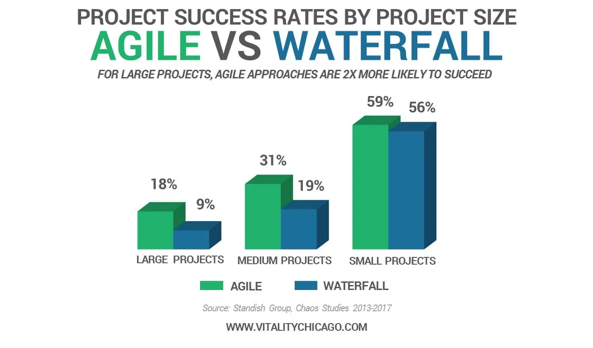

## 敏捷关注的是如何把能带来价值的事情又快又好地做成

敏捷这个术语是2001年敏捷联盟在[敏捷宣言](https://agilemanifesto.org/iso/zhchs/manifesto.html)中提出的，包含两部分：4个价值观和12条原则。

### 敏捷宣言中的4个价值观

> **个体和互动** 高于 **流程和工具** 
> **工作的软件** 高于 **详尽的文档** 
> **客户合作** 高于 **合同谈判** 
> **响应变化** 高于 **遵循计划** 

### 敏捷宣言中的12条原则

12条原则其实是4个价值观的衍生。

> 1. 我们最重要的目标，是通过持续不断地及早交付有价值的软件使客户满意。
> 1. 欣然面对需求变化，即使在开发后期也一样。为了客户的竞争优势，敏捷过程掌控变化。
> 1. 经常地交付可工作的软件，相隔几星期或一两个月，倾向于采取较短的周期。
> 1. 业务人员和开发人员必须相互合作，项目中的每一天都不例外。
> 1. 激发个体的斗志，以他们为核心搭建项目。提供所需的环境和支援，辅以信任，从而达成目标。
> 1. 不论团队内外，传递信息效果最好效率也最高的方式是面对面的交谈。
> 1. 可工作的软件是进度的首要度量标准。
> 1. 敏捷过程倡导可持续开发。责任人、开发人员和用户要能够共同维持其步调稳定延续。
> 1. 坚持不懈地追求技术卓越和良好设计，敏捷能力由此增强。
> 1. 以简洁为本，它是极力减少不必要工作量的艺术。
> 1. 最好的架构、需求和设计出自自组织团队。
> 1. 团队定期地反思如何能提高成效，并依此调整自身的举止表现。

这种听君一席话如听一席话，说了和没说一样的敏捷宣言，让我不得不怀疑很多听起来都不值得称之为理论的东西被捧到神坛，要么是发表这个理论的人是在故弄玄虚，要么就是他需要把这件事讲的足够抽象才能让它兼容尽可能多的具体案例。很多管理学的理论，看起来仿佛就是一些人为了塑造影响力，把一些理所当然的生活逻辑，一些我们很不会认为能上升为理论的事情写到了书里面去。

> 我们这个行业不尊重传统，只尊重创新。 
> — Satya Nadella（微软首席执行官）

在那个很多年前刚接触敏捷的我看来就是如此，随着经手的项目越来越多，才发觉其实是这帮人没有把敏捷讲清楚，敏捷实践出现的时间远远早于敏捷宣言的诞生，或者说对于一个善于思考的人，完全可以在不知道敏捷概念的基础上摸索出用敏捷的方式做事，只是组成敏捷联盟的这17个人受制于知识诅咒没能把这种哲学的前因后果讲明白。

> 一旦人了解了某种知识，就很难站在没掌握这个知识的角度，去思考和理解他人，也就是被知识诅咒了。 
> — Robin Hogarth

无论采用什么样的工作哲学和方法论，终极目标都是把能带来**价值**的事情又**快**又**好**地**做成**，因此不妨先忘记敏捷这个术语，以终为始，由果索因，找找什么样的原因才能导致这个结果。

## 做什么事，这个问题是首要问题

什么是有价值的事情？怎么判断一件事情有没有价值？怎么快速地验证一件事情有没有价值？

> “失败是成功之母”这句话我是不大同意的。你想想，失败一次，再来，然后再失败，哪还有勇气，哪还有机会，哪还有能力去成功？应该是积小胜为大胜，积累一个一个的小成功。当然，这中间可能有失败，失败可以有很多，但绝对不能致命。从量上来讲，成功至少要占 51%，失败的时候少于 49%，做到这样，一个一个的小成功，会让人逐步地有信心。所以一开始目标不要太大，定小目标，你把它完成之后，可以再做一个，然后再做一个，只要大方向不受影响，即使过程中遭到挫败了，继续做下去，也还具备成功的条件。要积累经验，积累小胜，小胜多了，就是成功。 
> — 王石

做什么产品这是个问题，思考问题，既要全面，又要能抓住重点。

> MECE原则（ Mutually Exclusive and Collectively Exhaustive）, 彼此排斥且无遗漏/相互独立且完全穷尽

5W2H就是遵循MECE原则的一种分析方法，它提供了一种问题拆解的角度。

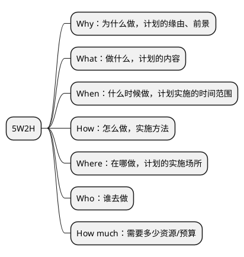

其中，Why，What，How much就是“做什么产品”构成了问题的答案。

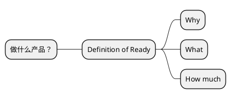

寻找答案的过程分为2步：

- 通过产品探索（Product Discovery）确定产品的初始需求。
- 通过不断的“积小胜为大胜”调整产品战略直至取得商业成功。

所以，“做什么产品”这个问题是贯穿始终且持续调整的，而敏捷及其方法论，讲的就是如何“积小胜为大胜”。

## 拆解目标：把能带来价值的事情又快又好地做成

### 目标之一：事情能成是底线

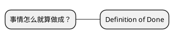

### 目标之一：产品得有价值

产品价值 = 用户价值 + 商业价值 + 社会价值

- 用户价值：帮助需求侧用户/客户解决什么问题，再直白点就是帮用户/客户赚了/省了多少钱。
- 商业价值：作为产品供应侧，你从这笔交易中的获利，比较常见的如用户量、生产资料、财务收入、客户满意度等。
- 社会价值：产品、服务或解决方案对社会的影响和贡献，比如可持续发展、环境保护、社会责任等。

### 目标之一：事情要做的又快又好

效率高就是快，质量高就是好。

### 目标之间互相制约

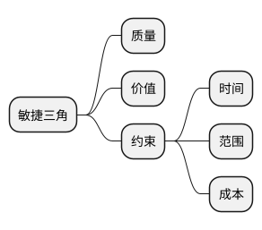

## 循着目标找方案




1946年，计算机问世。



1957年，迭代和增量式软件开发方法（iterative and incremental software development methods）出现。软件行业在计算机问世10年后就搞清楚了如何运作一个商业的软件项目。



1970年，渐进式项目管理（evolutionary project management）和适应性软件开发（adaptive software development）方法出现。



从1990年开始，传统重型软件开发方法（heavyweight methods），通常被统称为瀑布（waterfall）模型，在当时被批评为：
<ul>
    <li>过于刻板（overly regulated）</li>
    <li>计划过度（over planned）</li>
    <li>过度控制（over micromanaged）</li>
</ul>
因此，一系列轻量级软件开发方法（lightweight software development methods）开始出现：

<ul>
    <li>1991年，快速应用开发（rapid application development，RAD）</li>
    <li>1994年，统一过程（unified process，UP）和动态系统开发方法（dynamic systems development method，DSDM）</li>
    <li>1995年，Scrum</li>
    <li>1996年，Crystal Clear和极限编程（extreme programming，XP）</li>
    <li>1997年，特性驱动开发（feature-driven development，FDD）</li>
</ul>

尽管这些方法都源于《敏捷宣言》（Agile Manifesto）发布之前，但现在被统称为敏捷软件开发方法。



从1991年开始，不仅是软件行业，制造业以及企业管理也开始出现类似的、源自精益管理（Lean management）思想的变革。



2001年，在美国犹他州雪鸟度假村，17个软件从业专家聚在一起，组成了敏捷联盟（Agile Alliance），讨论研究了一遍从软件行业诞生以来的所有轻量级开发方法，然后发布了敏捷宣言。



2005年，由Cockburn和Highsmith领导的一个团队撰写了项目管理原则（project management principles）的附录，即《PM相互依存宣言（PM Declaration of Interdependence）》，以指导按照敏捷软件开发方法进行软件项目管理。



2009年，由Martin领导的一个团队撰写了软件开发原则的扩展，即《软件工匠宣言（Software Craftsmanship Manifesto）》，以指导按照专业行为进行敏捷软件开发。



2011年，敏捷联盟创建了《敏捷实践指南（Guide to Agile Practices）》（2016年更名为《敏捷词汇表（Agile Glossary）》），这是一个不断发展的开源文集，包含了敏捷实践、术语和元素的工作定义，以及来自全球敏捷从业者社区的解释和经验指南。




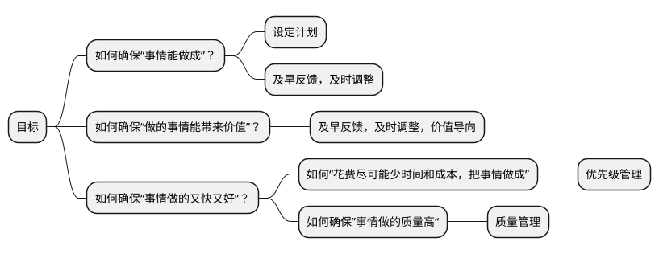

所以

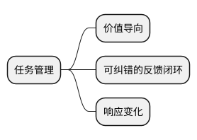

> “你生命中最大的挑战是什么？”“确保有一个可纠错的反馈闭环。” 
> — 伊隆·马斯克（Elon Musk）

如果你是一个人在做事，没有团队，那么读到这里就够了，你只要把要做的事情分解为任务列表，然后按照Time Boxing的方式，每隔一段时间把做好的一部分发放到市场上收集反馈，然后改进就可以了。

但是如果你是在靠团队做事，那么就得想想从个体到团队需要额外考虑哪些因素。你想，现在一个大脑变成了多个大脑，虽然“多一个人，多一份力量”，但是每个大脑知道什么，知道到什么程度，会解决什么什么问题，能解决多难的问题互相不完全清楚，因此额外要考虑的因素就是协作。

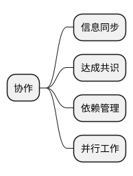

因此我们得到一个团队的成事哲学：

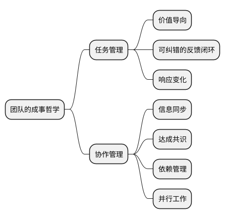

把以上成事哲学稍微整理一下就是敏捷。

敏捷中提到了很多点，敏捷的思想是适合于全天下所有的项目的，只是不同的项目在应用敏捷时侧重点不同。火箭就不能快速验证，软件结合的如何敏捷，要求一个项目全面敏捷是教条主义。

敏捷本身是经验主义，精益，随机应变的结合。

## 敏捷方法论之Scrum

敏捷本身只是一组价值观和原则，符合价值观和原则的实践都属于敏捷方法论（Agile methodology）。

所谓Sprint Backlog，就是任务列表，列表代表着有序，有序代表着优先级不同，因此设定好优先级的任务列表就是迭代计划。

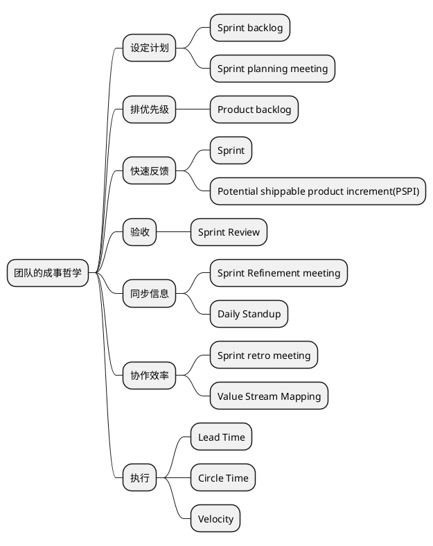

### 高效会议

会议能履行职责，同时避免浪费与会人员的时间。

10人以下的，角色完备的小规模团队是最佳团队配置，团队越小，规矩越少，效果越高。

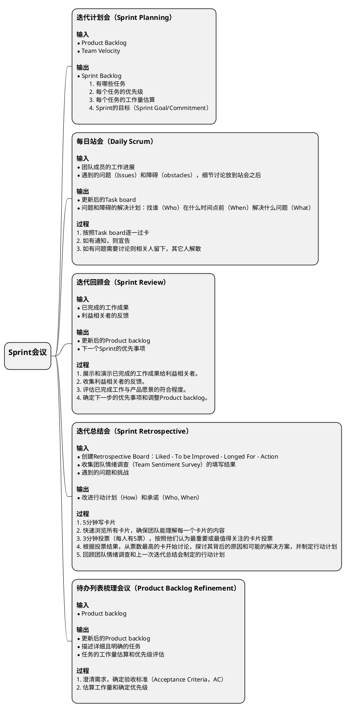

Refinement是加工、提炼的意思，Refinement在之前还有一个名字，叫做Grooming，后来Scrum联盟改用Refinement。在Scrum里，其实就是对下阶段的需求做一个讨论、澄清、细化的一个活动，使得团队能对后续阶段的需求能达成共识，尽量避免团队因为对需求理解的不一致所导致的各类问题，并帮助团队在下个迭代开始的时候更快进入开发状态，它一般是发生在下个迭代开始前的一段时间里。

Refinement并不止在会议上发生，需求的梳理其实不仅仅只发生在每个迭代的Refinement的会议上，它其实应该是贯彻发生在整个软件开发的全过程中。只是在Refinement 会议上做了最大量的需求梳理的工作，然后从Sprint的开始，花费在需求梳理上的时间会慢慢减少，花费在软件设计开发上的时间慢慢增加，到了Sprint得后期就慢慢没有了需求方面的工作而只剩下开发上面的工作了。

整个Refinement的过程也可以简单看成发散加收敛的过程。

发散就是针对story做发散思维的讨论，尽力考虑到各个方面的问题、假设、困难，防止专家思维的局限，这是个头脑风暴的过程。
PO和架构师需要在团队讨论的过程中随时解答疑问，不能当场澄清的，PO需要会后带回去，在迭代计划会前完成澄清。

问题应该是多角度的：
- 功能性的需求（Functional Requirement，FR）
- 跨功能需求（Cross-Functional Requirements，CFR）/ 非功能性需求（Non-functional requirement，NFR）：可测试性，可维护性，可用性，兼容性，性能，稳定性

在充分发散的基础上就可以开始收敛，明确验收标准（Acceptance Criteria，AC）。

## 怎么才能做好敏捷

敏捷存在的意义不是为了让开发团队遵循敏捷，这不是敏捷的目标，只是手段。敏捷价值观和原则，敏捷的各种方法论，目标是为了能成事，只要是能成事的实践都是好的实践。

### Scrum中的各种会议是不是必须都要按时按点举行？

不是，这些会对应的目的能达成的话，如果有其他更好的形式，那完全okay，这些会甚至都可以完全取消。

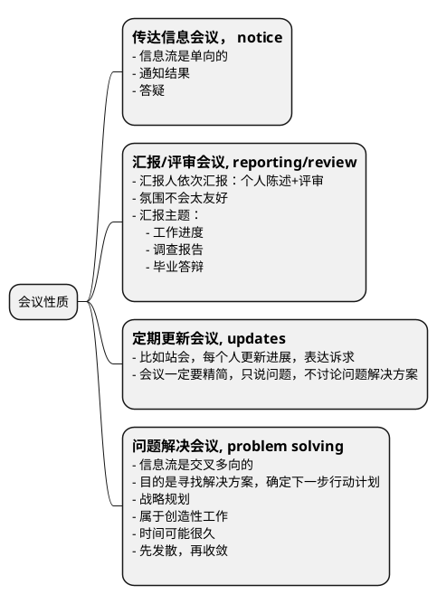

- Sprint Planning，迭代计划会 - 传达信息会议
- Daily Scrum，每日站会 - 定期更新会议
- Sprint Review，迭代回顾会 - 汇报/评审会议
- Sprint Retrospective，迭代总结会 - 问题解决会议
- Backlog Refinement，待办列表梳理会议 - 问题解决会议

相比于会议，只要有更高效且能达成相同效果的形式，那么这些会议都可以取消，会议是一种同步沟通的手段，其他的形式那可能是基于邮件/task board/即时通讯等异步沟通手段，同步和异步的差异其实就是会议特有的另外一个功能：会议是可以现场收集到所有与会人员确认信息被收到并理解的回执的，就如同你发了一个短信有短信回执一样，作为会议的主持人你能确切地从与会者参会的表现获得他收到信息的证据。

- 团队人数过多（>10）的时候，这种回执的效果会变的很差，这个时候全员会议应该尽可能少，应该依赖异步沟通+强有力的task board management来完成。
- 当团队人数过少（<=3）的时候，沟通效率很高，因此会议应该尽量少。
- 凡是需要团队外部参与的会议，不应该被轻易取消。
- 所有的会议应该只邀请必要的与会人员。

### 产品的需求稳定不变，有必要采用敏捷吗？

### 如何提高组织对敏捷的认知

- 对于团队内非管理岗位的成员，敏捷的认知普及要教条一些，以遵循实践原则为主。
- 对于管理岗位的成员，敏捷的认知要进阶，要学会知其本源灵活应用。

### 大型组织内如何实践敏捷

怎么算是大型组织？规模在100人以上的团队都算作大型组织。

#### 依赖管理

#### 需求管理

#### 组织拓扑

### 如何评估一个组织的敏捷程度

#### 敏捷成熟度模型（Agile Maturity Model）

业内有很多敏捷成熟度模型的定义，即从多个维度分别进行打分。

#### 价值流图

价值流图的作用主要是为了在评估过程中帮助梳理团队的工作流，并识别出痛点，类似的，在特斯拉，伊隆·马斯克要求流水线上每个环节必须有对应时长的显式，这样可以持续的看到在哪个环节耗时比较久，进行改进生产线。

#### 评估手段

- 观察
- 访谈
