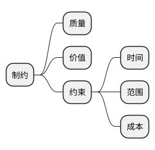
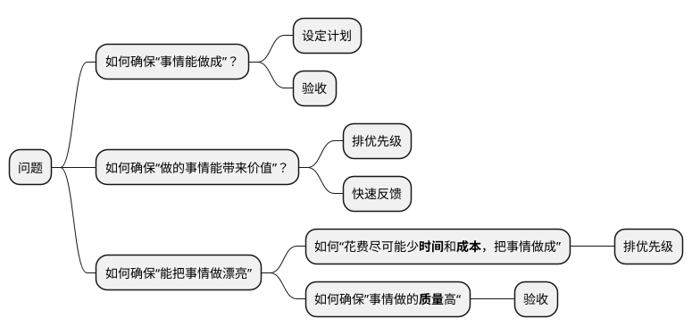
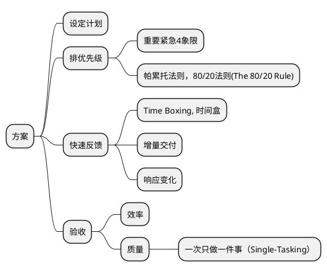
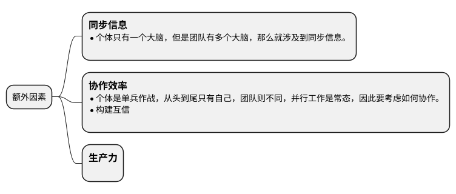
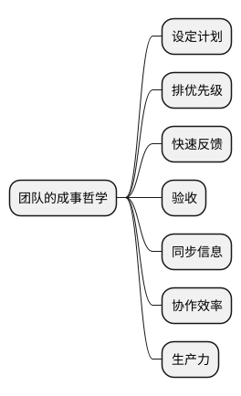
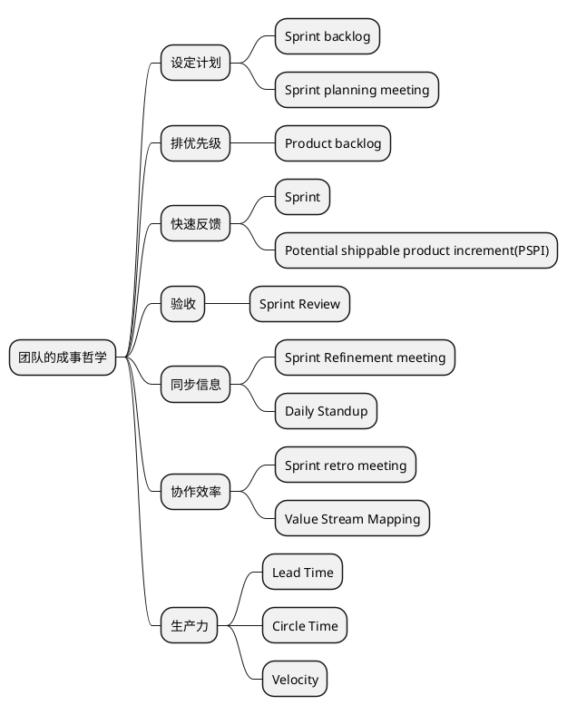
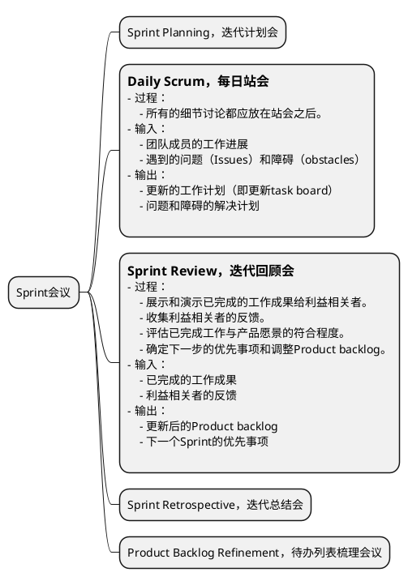
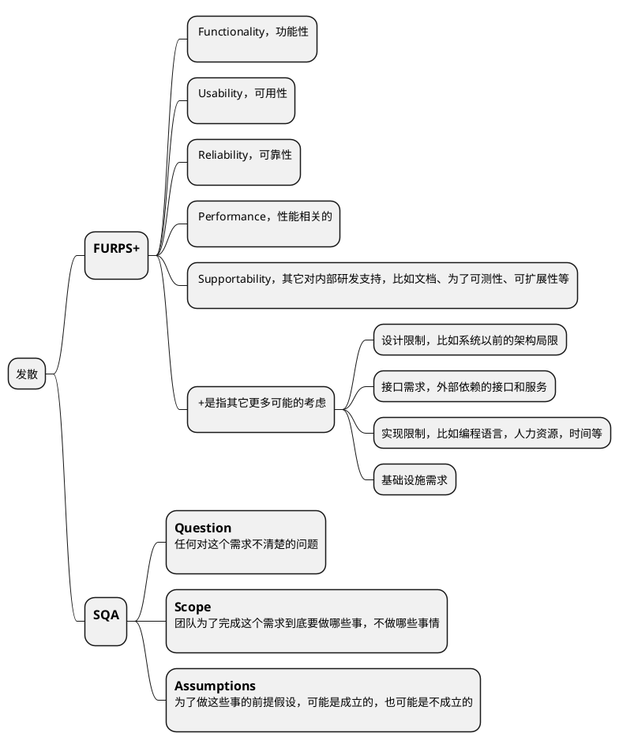
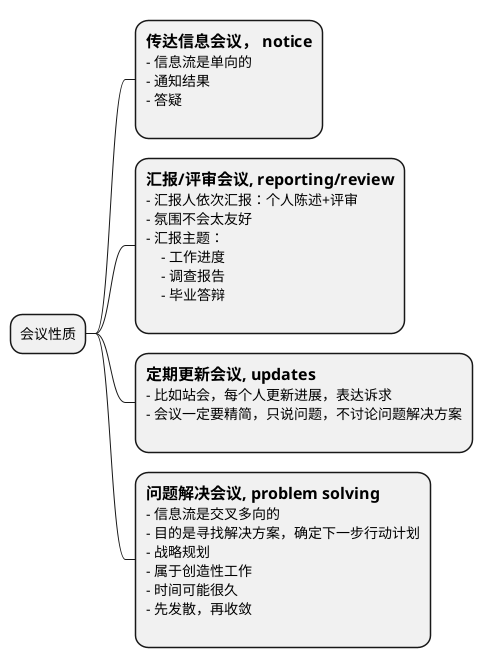

很多时候我不得不怀疑很多理论听起来离实际工作如此遥远，要么是发表这个理论的人是在故弄玄虚，要么就是他需要把这件事讲的足够抽象才能让它兼容尽可能多的具体案例。很多管理学的理论，在现在看来仿佛就是一群人为了博得名利，把一些理所当然的生活逻辑，我们很不不会认为能后上升为理论的事情写到了书里面去。在那个很多年前刚接触敏捷的我看来就是如此，随着经手的项目越来越多，才发觉其实这帮人没有把敏捷在敏捷宣言中讲明白，简而言之，它希望告诉软件团队，要想成事，你得从战略上想着如何通过频繁尝试来避免事情不成，它强调的是频繁，它强调的不是快。

## 1. 成事

成事是人实现自身价值的方式。无论采用什么样的哲学和方法论，我们都希望帮助成事，所以让我们先忘记敏捷，从第一性原理出发，想想什么是能成事。

### 1.1. 我们总是希望事情能做成

这是最基本的诉求，事情捡重要的做，评价事情成败的关键就是，这个事情中最重要的部分有没有做成，这个最重要的部分就是**范围**。

### 1.2. 我们希望做的事情能带来价值

不能带来**价值**的事情没有必要做，我们要做的事可能是生产产品，提供服务，设计解决方案。

以产品为例：`产品价值 = 用户价值 + 商业价值 + 社会价值`

- 用户价值就是帮需求侧用户解决什么问题，再直白点就是帮客户赚了/省了多少钱。
- 商业价值就是作为产品供应侧，你从这笔交易中的获利，比较常见的如用户量、生产资料、财务收入、客户满意度等。
- 社会价值就是产品、服务或解决方案对社会的影响和贡献，比如可持续发展、环境保护、社会责任等。

### 1.3. 我们不仅希望把事做成，还希望把事情做漂亮

- 我们希望花费尽可能少**时间**和**成本**，把事情做成
    有限的时间，成本是做事不得不遵循的限制。
- 我们希望事情做的**质量**高

上面所提到的种种诉求互相制约，就形成了一个三角：



## 2. 从人类历史中找到成事的最佳实践



所以



如果你是一个人在做事，没有团队，那么读到这里就够了，你只要把要做的事情分解为任务列表，然后按照Time Boxing的方式，每隔一段时间把做好的一部分发放到市场上收集反馈，然后改进就可以了。

但是如果你是在靠团队做事，那么就得想想从个体到团队需要额外考虑哪些因素：



因此我们得到一个团队的成事哲学：



把以上成事哲学稍微整理一下就是敏捷。

## 3. 敏捷

敏捷这个术语是2001 年在[敏捷宣言](https://agilemanifesto.org/iso/zhchs/manifesto.html)中提出的。

2001年初，在美国犹他州雪鸟度假村，17个软件从业者聚在一起，组成了敏捷联盟，讨论研究了一遍从软件行业诞生以来的所有轻量级开发方法，然后发布了敏捷宣言。

敏捷宣言包含两部分内容：4个价值观和12条原则。

敏捷就源自敏捷宣言。

### 3.1. 敏捷宣言中的4个价值观

敏捷只是成事哲学的进一步抽象。

- **个体和互动** 高于 **流程和工具**
- **工作的软件** 高于 **详尽的文档**
- **客户合作** 高于 **合同谈判**
- **响应变化** 高于 **遵循计划**


### 3.2. 敏捷宣言中的12条原则

12条原则其实是4个价值观的衍生，是敏捷联盟担心人们看不懂敏捷价值观而作出的补充解释。

1. 我们最重要的目标，是通过持续不断地及早交付有价值的软件使客户满意。
1. 欣然面对需求变化，即使在开发后期也一样。为了客户的竞争优势，敏捷过程掌控变化。
1. 经常地交付可工作的软件，相隔几星期或一两个月，倾向于采取较短的周期。
1. 业务人员和开发人员必须相互合作，项目中的每一天都不例外。
1. 激发个体的斗志，以他们为核心搭建项目。提供所需的环境和支援，辅以信任，从而达成目标。
1. 不论团队内外，传递信息效果最好效率也最高的方式是面对面的交谈。
1. 可工作的软件是进度的首要度量标准。
1. 敏捷过程倡导可持续开发。责任人、开发人员和用户要能够共同维持其步调稳定延续。
1. 坚持不懈地追求技术卓越和良好设计，敏捷能力由此增强。
1. 以简洁为本，它是极力减少不必要工作量的艺术。
1. 最好的架构、需求和设计出自自组织团队。
1. 团队定期地反思如何能提高成效，并依此调整自身的举止表现。

## 4. 敏捷方法论之Scrum

敏捷价值过于抽象了，我们拿着成事哲学来看看，有哪些实践能让一个团队成事。



### 4.1. 高效会议

会议的实践原则只有一个：让这个会议能高效地履行职责，避免浪费与会人员的时间和精力。



### Sprint Planning，迭代计划会

#### 输入

- Product Backlog
- Team Velocity

#### 输出

- Sprint Backlog
    - Commitment：Sprint的目标（Sprint Goal）
    - 任务的工作量估算
    - 计划（任务列表）：Todo items

### Sprint Retrospective，迭代总结会

#### 会前准备

1. 收集Team Sentiment Survey（团队情绪调查）

```markdown
1. How's your overall happiness for the past 2 weeks (more smiles means more happiness)

2. I find the upcoming work
    - Interesting and something to look forward to
    - OK but nothing to get excited about
    - So fun that I am looking forward to a nap

3. How challenged are you feeling about the work?
    - I am in my comfort zone, nothing in the domain challenges me at the moment
    - It's a good balance, I know my capabilities and I am expanding them through upcoming challenges
    - I feel being pushed out of my comfort zone everyday and most of the tasks involve some degree of uncertainty

4. The kind of work I find most interesting and challenging is...

5. In the past iteration I have learned new things from the team
    - Yes
    - No

6. During the past iteration, while working, I have laughed
    - Many times
    - Just a few times
    - Never. Work crushes any thought of laughter

7. Connectedness
    - I am engaged and feel connected to the team
    - It's so so...a bit hit and miss
    - I often feel isolated and on my own

8. Support
    - I feel strongly supported by people, processes, tools and resources in doing my job
    - I have just enough support to get by
    - There is little support given and I am often stuck

9. I feel confident to voice my ideas and challenge other people's opinion/approach/solution even if it is different to mine
    - Always
    - Often
    - Sometimes
    - Rarely
    - Never

10. Personal well-being
    - I have routines that create positive mental and physical health
    - I'm OK...just plodding along
    - I often feel unwell physically, mentally or both

11. I feel the work I do is recognized and appreciated
    - Yes, I feel recognized and appreciated
    - So so, it could be better
    - No, I toil in the background like a nameless cog in an ever turning machine

12. Recognition for me looks like...

13. Anything else you want to add/improve

14. What could we do next iteration to make you happier?
```

#### 过程

- 回顾和评估上一个迭代遇到的的问题、挑战和改进机会。
- 制定行动计划。
- 回顾上一次迭代总结会制定的行动计划的进展。

#### 输入

- 遇到的问题和挑战

#### 输出

- 改进行动计划（plans，**怎么做**）和承诺（commitments，**什么时候完成**）

### 4.2. Product Backlog Refinement，待办列表梳理会议

#### 输入

- Product backlog

#### 输出

- 更新后的Product backlog
- 描述详细且明确的任务
- 任务的工作量估算和优先级评估

#### 过程

- 澄清需求。
- 估算工作量和确定优先级。

Refinement是加工、提炼的意思，refinement在之前还有一个名字，叫做grooming，后来scrum联盟改用refinement。在Scrum里，其实就是对下阶段的需求做一个讨论、澄清、细化的一个活动，使得团队能对后续阶段的需求能达成共识，尽量避免团队因为对需求理解的不一致所导致的各类问题，并帮助团队在下个迭代开始的时候更快进入开发状态，它一般是发生在下个迭代开始前的一段时间里。

需要注意的是，refinement并不止在会议上发生，需求的梳理其实不仅仅只发生在每个迭代的refinement的会议上，它其实应该是贯彻发生在整个软件开发的全过程中。只是在refinement 会议上做了最大量的需求梳理的工作，然后从sprint的开始，花费在需求梳理上的时间会慢慢减少，花费在软件设计开发上的时间慢慢增加，到了sprint得后期就慢慢没有了需求方面的工作而只剩下开发上面的工作了。

整个refinement的过程也可以简单看成发散+收敛的过程：

#### 4.2.1. 发散

发散的意思就是在对一个story做梳理的前期，我们需要针对目标story做发散思维的讨论，尽力考虑到各个方面的问题、假设、困难，防止专家思维的局限，这是个头脑风暴的过程。

- 暂缓对别人观点的评论
- 鼓励异想天开的想法
- 可以在别人的观点上继续延伸
- 专注在story上，不要离题
- 图文并茂，鼓励使用可视化的方式
- 做加法，点子越多越好（先不关注点子的质量）

为了更好的引导这个头脑风暴的过程，我们常见的指导分析方法有：



- **FURPS+** 更像一个checklist，它能提醒我们在发散的时候要从这些角度去思考，避免重大遗漏。
- **SQA** 在实际中更加常用和易用。SQA就是通过大家一起回答目标story的三个问题来澄清我们的需求。这里会有很多疑问和假设，PO需要在团队讨论的过程中随时解答团队的疑问和澄清假设，不能当场澄清的，团队和PO需要会后带回去，在下个迭代planning meeting前完成澄清。

#### 4.2.2. 收敛

在充分发散的基础上我们就要开始收敛，这样我们才能拿到refinement最终的结果，这就是收敛的过程。为了帮助收敛，我们常用的手段有：
- 明确产出结果形式
- 投票找到公认的重点
- 时间盒

## 5. 怎么才能做好敏捷

敏捷存在的意义不是为了让开发团队遵循敏捷，这不是敏捷的目标，只是手段。敏捷价值观和原则，敏捷的各种方法论，目标是为了能成事，只要是能成事的实践都是好的实践。

### 5.1. Scrum中的各种会议是不是必须都要按时按点举行？

不是，这些会对应的目的能达成的话，如果有其他更好的形式，那完全okay，这些会甚至都可以完全取消。



- Sprint Planning，迭代计划会 - 传达信息会议
- Daily Scrum，每日站会 - 定期更新会议
- Sprint Review，迭代回顾会 - 汇报/评审会议
- Sprint Retrospective，迭代总结会 - 问题解决会议
- Backlog Refinement，待办列表梳理会议 - 问题解决会议

相比于会议，只要有更高效且能达成相同效果的形式，那么这些会议都可以取消，会议是一种同步沟通的手段，其他的形式那可能是基于邮件/task board/即时通讯等异步沟通手段，同步和异步的差异其实就是会议特有的另外一个功能：会议是可以现场收集到所有与会人员确认信息被收到并理解的回执的，就如同你发了一个短信有短信回执一样，作为会议的主持人你能确切地从与会者参会的表现获得他收到信息的证据。

- 团队人数过多（>10）的时候，这种回执的效果会变的很差，这个时候全员会议应该尽可能少，应该依赖异步沟通+强有力的task board management来完成。
- 当团队人数过少（<=3）的时候，沟通效率很高，因此会议应该尽量少。
- 凡是需要团队外部参与的会议，不应该被轻易取消。
- 所有的会议应该只邀请必要的与会人员。

### 5.2. 产品的需求稳定不变，有必要采用敏捷吗？

### 5.3. 如何提高组织对敏捷的认知

- 对于团队内非管理岗位的成员，敏捷的认知普及要教条一些，以遵循实践原则为主。
- 对于管理岗位的成员，敏捷的认知要进阶，要学会知其本源灵活应用。

### 5.4. 大型组织内如何实践敏捷

怎么算是大型组织？规模在100人以上的团队都算作大型组织。

#### 5.4.1. 依赖管理

#### 5.4.2. 需求管理

#### 5.4.3. 组织拓扑

### 5.5. 如何评估一个组织的敏捷程度

#### 5.5.1. 敏捷成熟度模型（Agile Maturity Model）

业内有很多敏捷成熟度模型的定义，即从多个维度分别进行打分。

#### 5.5.2. 价值流图

价值流图的作用主要是为了在评估过程中帮助梳理团队的工作流，并识别出痛点，类似的，在特斯拉，马斯克要求流水线上每个环节必须有对应时长的显式，这样可以持续的看到在哪个环节耗时比较久，进行改进生产线。

#### 5.5.3. 评估手段

- 观察
- 访谈
