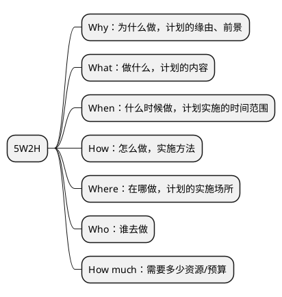
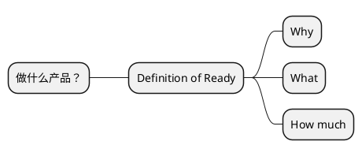
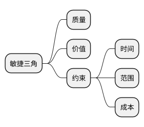
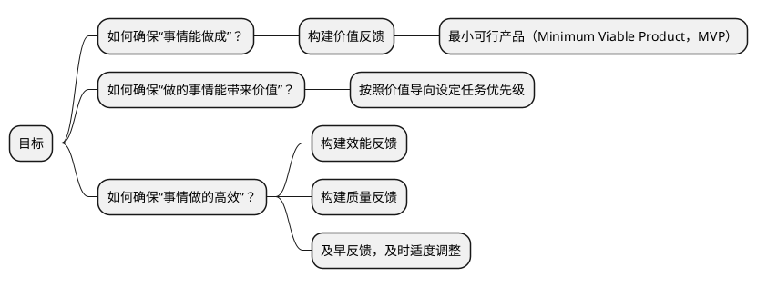
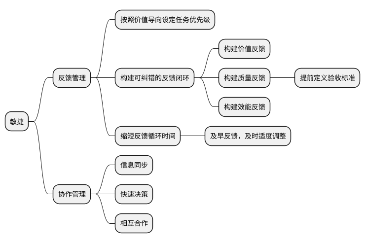

企业的**组织架构**和**项目管理方法**应该顺应企业规模，员工能力和产品需求，而敏捷，就是软件项目管理的顶级成功哲学。

## 敏捷发展史




计算机问世。



迭代和增量式软件开发方法（iterative and incremental software development methods）出现。软件行业在计算机问世10年后就搞清楚了如何运作一个商业的软件项目。



渐进式项目管理（evolutionary project management）和适应性软件开发（adaptive software development）方法出现。



传统重型软件开发方法（heavyweight methods），通常被统称为瀑布（waterfall）模型，在当时被批评为：
<pre>
• 过于刻板（overly regulated）
• 计划过度（over planned）
• 过度控制（over micromanaged）
</pre>
因此，一系列轻量级软件开发方法（lightweight software development methods）开始出现：
<pre>
<b>1991年</b>
  • 快速应用开发（rapid application development，RAD）
<b>1994年</b>
  • 统一过程（unified process，UP）
  • 动态系统开发方法（dynamic systems development method，DSDM）
<b>1995年</b>
  • Scrum
<b>1996年</b>
  • Crystal Clear
  • 极限编程（extreme programming，XP）
<b>1997年</b>
  • 特性驱动开发（feature-driven development，FDD）
</pre>
尽管这些方法都源于《敏捷宣言》（Agile Manifesto）发布之前，但现在被统称为敏捷软件开发方法。



不仅是软件行业，制造业以及企业管理也开始出现类似的、源自精益管理（Lean management）思想的变革。



在美国犹他州雪鸟度假村，17个软件从业专家聚在一起，组成了敏捷联盟（Agile Alliance），讨论研究了一遍从软件行业诞生以来的所有轻量级开发方法，然后发布了敏捷宣言。



由Cockburn和Highsmith领导的一个团队撰写了项目管理原则（project management principles）的附录，即《PM相互依存宣言（PM Declaration of Interdependence）》，以指导按照敏捷软件开发方法进行软件项目管理。



由Martin领导的一个团队撰写了软件开发原则的扩展，即《软件工匠宣言（Software Craftsmanship Manifesto）》，以指导按照专业行为进行敏捷软件开发。



敏捷联盟创建了《敏捷实践指南（Guide to Agile Practices）》（2016年更名为《敏捷词汇表（Agile Glossary）》），这是一个不断发展的开源文集，包含了敏捷实践、术语和元素的工作定义，以及来自全球敏捷从业者社区的解释和经验指南。




## 敏捷关注的是如何把能带来价值的事情高效地做成

敏捷这个术语是2001年敏捷联盟在[敏捷宣言](https://agilemanifesto.org/iso/zhchs/manifesto.html)中提出的，包含两部分：价值观和原则。

### 敏捷宣言中的价值观

- **个体和互动** 高于 **流程和工具**
    > Individuals and interactions over processes and tools
- **工作的软件** 高于 **详尽的文档**
    > Working software over comprehensive documentation
- **客户合作** 高于 **合同谈判**
    > Customer collaboration over contract negotiation
- **响应变化** 高于 **遵循计划**
    > Responding to change over following a plan

### 敏捷宣言中的原则

12条原则其实是4个价值观的衍生。

> 1. 我们最重要的目标，是通过持续不断地及早交付有价值的软件使客户满意。
> 1. 欣然面对需求变化，即使在开发后期也一样。为了客户的竞争优势，敏捷过程掌控变化。
> 1. 经常地交付可工作的软件，相隔几星期或一两个月，倾向于采取较短的周期。
> 1. 业务人员和开发人员必须相互合作，项目中的每一天都不例外。
> 1. 激发个体的斗志，以他们为核心搭建项目。提供所需的环境和支援，辅以信任，从而达成目标。
> 1. 不论团队内外，传递信息效果最好效率也最高的方式是面对面的交谈。
> 1. 可工作的软件是进度的首要度量标准。
> 1. 敏捷过程倡导可持续开发。责任人、开发人员和用户要能够共同维持其步调稳定延续。
> 1. 坚持不懈地追求技术卓越和良好设计，敏捷能力由此增强。
> 1. 以简洁为本，它是极力减少不必要工作量的艺术。
> 1. 最好的架构、需求和设计出自自组织团队。
> 1. 团队定期地反思如何能提高成效，并依此调整自身的举止表现。

这种听君一席话如听一席话，说了和没说一样的敏捷宣言，让我不得不怀疑很多听起来都不值得称之为理论的东西被捧到神坛，要么是发表这个理论的人是在故弄玄虚，要么就是他需要把这件事讲的足够抽象才能让它兼容尽可能多的具体案例。很多管理学的理论，看起来仿佛就是一些人为了塑造影响力，把一些理所当然的生活逻辑，一些我们很不会认为能上升为理论的事情写到了书里面去。

> 我们这个行业不尊重传统，只尊重创新。 
> — Satya Nadella（微软首席执行官）

在那个很多年前刚接触敏捷的我看来就是如此，随着经手的项目越来越多，才发觉其实是这帮人没有把敏捷讲清楚，敏捷实践出现的时间远远早于敏捷宣言的诞生，或者说对于一个善于思考的人，完全可以在不知道敏捷概念的基础上摸索出用敏捷的方式做事，只是组成敏捷联盟的这17个人受制于知识诅咒没能把这种哲学的前因后果讲明白。

> 一旦人了解了某种知识，就很难站在没掌握这个知识的角度，去思考和理解他人，也就是被知识诅咒了。 
> — Robin Hogarth

无论采用什么样的工作哲学和方法论，目的都是把能带来价值的事情高效地做成，因此不妨先忘记敏捷这个术语，以终为始，由果索因，找找什么样的原因才能导致这个结果。

## 首要问题是做什么事

什么是有价值的事情？怎么判断一件事情有没有价值？怎么快速地验证一件事情有没有价值？

> “失败是成功之母”这句话我是不大同意的。你想想，失败一次，再来，然后再失败，哪还有勇气，哪还有机会，哪还有能力去成功？应该是积小胜为大胜，积累一个一个的小成功。当然，这中间可能有失败，失败可以有很多，但绝对不能致命。从量上来讲，成功至少要占 51%，失败的时候少于 49%，做到这样，一个一个的小成功，会让人逐步地有信心。所以一开始目标不要太大，定小目标，你把它完成之后，可以再做一个，然后再做一个，只要大方向不受影响，即使过程中遭到挫败了，继续做下去，也还具备成功的条件。要积累经验，积累小胜，小胜多了，就是成功。 
> — 王石

做什么产品这是个问题，思考问题，既要全面，又要能抓住重点。

> MECE原则（ Mutually Exclusive and Collectively Exhaustive）, 彼此排斥且无遗漏/相互独立且完全穷尽

5W2H就是遵循MECE原则的一种分析方法，它提供了一种问题拆解的角度，所以问题的拆解都可以是5W2H的子集。

“做什么产品”关注的是Why，What，和How much。

“做什么产品”这个问题是贯穿始终且持续调整的：

- 通过产品探索（Product Discovery）确定产品的初始需求。
- 通过不断的“积小胜为大胜”调整产品战略直至取得商业成功。

而敏捷及其方法论，讲的就是如何“积小胜为大胜”。

## 拆解目标：把能带来价值的事情高效地做成

### 目标1：事情能成是底线

### 目标2：事情能产生价值

`价值 = 用户价值 + 商业价值 + 社会价值`

- **用户价值**：帮助需求侧用户/客户解决什么问题，再直白点就是帮用户/客户赚了/省了多少钱。
- **商业价值**：作为产品供应侧，你从这笔交易中的获利，比较常见的如用户量、生产资料、财务收入、客户满意度等。
- **社会价值**：产品、服务或解决方案对社会的影响和贡献，比如可持续发展、环境保护、社会责任等。

### 目标3：事情要做的高效

> 效能重视组织目标的达成，重视结果，追求**做对的事情(Doing the Right Things)**。

> 效率强调资源的有效利用，指以最少的投入，得到最大的产出，也就是**把事情做好(Doing Things Right)**。

高效指的是高效能和高效率。

### 目标之间互相制约

在竞争变化的商业环境中，如果实现的不是有价值的需求，哪怕你在成本、时间、范围和质量方面都很完美，这个产品做出来也是没有人使用的，一个没有人使用的东西，也就没有意义。

敏捷强调的是价值和质量，首先做出来的东西对客户是有价值的，且能满足客户的。在这个基础上变化是随时都有可能发生的，所以约束条件范围、时间、成本根据实际情况调整，提升客户的价值。

虽然不断的变化可能会给我们的进度、成本带来一定的冲击，但这就要求我们做好变化管理，提前识别和预判客户有价值的需求。敏捷团队最终的成功还是要看可用的产品。

## 循着目标找方案

> “你生命中最大的挑战是什么？”“确保有一个可纠错的反馈闭环。” 
> — 伊隆·马斯克（Elon Musk）

如果你是一个人在做事，没有团队，那么到此就够了，做好反馈管理就行，不要脱离市场闭门造车。

如果是一个团队，从个体扩展为团队后，虽然“多一个人，多一份力量”，但是个体之间如何协作是需要额外继续考虑的。

<!--
https://www.zhihu.com/question/400725089/answer/1879461212
-->

这就是敏捷的关键所在，不同的敏捷方法论只是在针对如何做好反馈管理和协作管理上提供了不同的实践方式。

敏捷强调的是灵活，不是快，灵活意味着能以最小的代价应对变化。

国人对于及早反馈这件事存在疑虑颇多的原因，与植根于我们的民族文化有关系，料事如神，未卜先知，心中有数，先见之明这种凸显高智商的词汇让大家觉得，没有一点进展就
