批判性思维

结构化思维

复盘思维

## 做事的过程就是消除不确定性的过程

一开始，当你还不确定要开发什么产品时，不确定性最高。然而，随后你获得了一个创意，清楚了自己的核心竞争力，认为这个创意可以盈利，这时不确定性稍微减小了一些，但并没有完全消失。因为你可能还不确定市场是否会接受你的产品。当你逐步分解产品需求，从问题领域到解决方案领域，一点点地减小了不确定性，直到你的商业模式得到验证，不确定性才会消失。

每个阶段消除不确定性的方法不同。

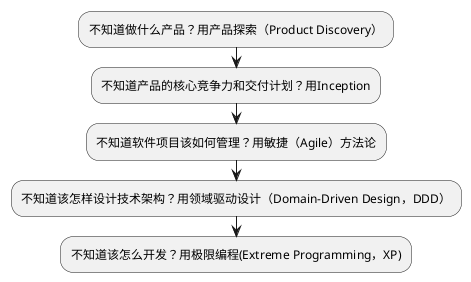

而敏捷，只是环节之一。

## 把能带来价值的事情又快又好地做成

敏捷这个术语是2001 年在[敏捷宣言](https://agilemanifesto.org/iso/zhchs/manifesto.html)中提出的。

2001年初，在美国犹他州雪鸟度假村，17个软件从业者聚在一起，组成了敏捷联盟，讨论研究了一遍从软件行业诞生以来的所有轻量级开发方法，然后发布了敏捷宣言。

> 很多时候我不得不怀疑很多理论听起来离实际工作如此遥远，要么是发表这个理论的人是在故弄玄虚，要么就是他需要把这件事讲的足够抽象才能让它兼容尽可能多的具体案例。很多管理学的理论，看起来仿佛就是一些人为了塑造影响力，把一些理所当然的生活逻辑，一些我们很不会认为能上升为理论的事情写到了书里面去。

在那个很多年前刚接触敏捷的我看来就是如此，随着经手的项目越来越多，才发觉其实提出敏捷的这帮人没有把敏捷总结明白，因为敏捷实践出现的时间远远早于敏捷宣言的诞生，或者说对于一个善于思考的人，完全可以在不知道敏捷概念的基础上摸索出用敏捷的方式做事，只是这17个人没能把这种哲学总结清楚。

> 我们这个行业不尊重传统，只尊重创新。 -- 纳德拉（微软首席执行官）

无论采用什么样的工作哲学和方法论，终极目标都是把能带来**价值**的事情又**快**又**好**地**做成**，因此不妨先忘记敏捷这个术语，以终为始，由果索因，找找什么样的原因才能导致这个终极目标的达成。

### 做什么产品

什么是有价值的事情？怎么判断一件事情有没有价值？怎么快速地验证一件事情有没有价值？

> “失败是成功之母”这句话我是不大同意的。你想想，失败一次，再来，然后再失败，哪还有勇气，哪还有机会，哪还有能力去成功？应该是积小胜为大胜，积累一个一个的小成功。当然，这中间可能有失败，失败可以有很多，但绝对不能致命。从量上来讲，成功至少要占 51%，失败的时候少于 49%，做到这样，一个一个的小成功，会让人逐步地有信心。所以一开始目标不要太大，定小目标，你把它完成之后，可以再做一个，然后再做一个，只要大方向不受影响，即使过程中遭到挫败了，继续做下去，也还具备成功的条件。要积累经验，积累小胜，小胜多了，就是成功。 -- 王石

做什么产品这是个问题，思考问题，既要全面，又要能抓住重点。

> MECE准则（ Mutually Exclusive and Collectively Exhaustive）, 彼此排斥且无遗漏/相互独立且完全穷尽

5W2H就是遵循MECE准则的一种分析方法，它提供了一种问题拆解的角度。

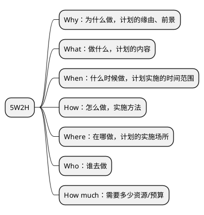

其中，Why，What，How much就是“做什么产品”构成了问题的答案。

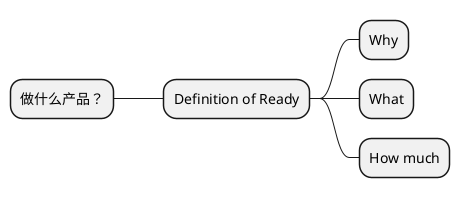

寻找答案的过程分为2步：

- 通过产品探索（Product Discovery）确定产品的初始需求。
- 通过不断的“积小胜为大胜”调整产品战略直至取得商业成功。

所以，“做什么产品”这个问题是贯穿始终且持续调整的，而敏捷及其方法论，讲的就是如何“积小胜为大胜”。

## 拆解终结目标

> 把能带来价值的事情又快又好地做成

### 目标之一：事情能成是底线

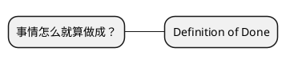

### 目标之一：产品得有价值

> 产品价值 = 用户价值 + 商业价值 + 社会价值

- 用户价值：帮助需求侧用户/客户解决什么问题，再直白点就是帮用户/客户赚了/省了多少钱。
- 商业价值：作为产品供应侧，你从这笔交易中的获利，比较常见的如用户量、生产资料、财务收入、客户满意度等。
- 社会价值：产品、服务或解决方案对社会的影响和贡献，比如可持续发展、环境保护、社会责任等。

### 目标之一：事情要做的又快又好

效率高就是快，质量高就是好。

## 目标之间互相制约

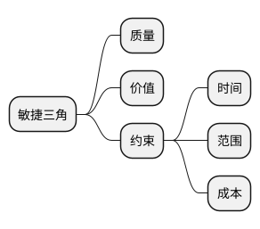

## 循着目标找方案

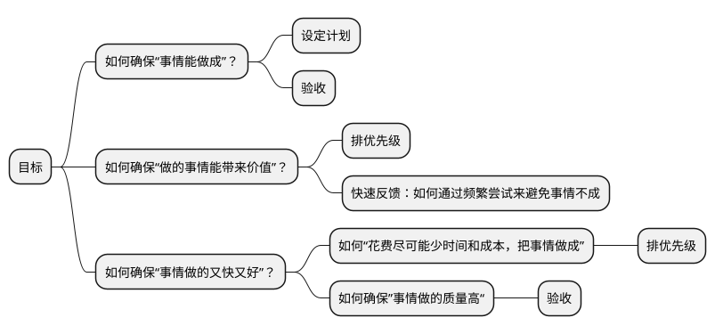

所以

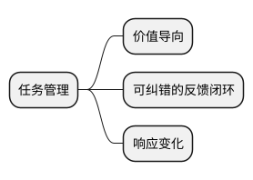

> “你生命中最大的挑战是什么？”“确保有一个可纠错的反馈闭环。” -- 埃隆·马斯克

如果你是一个人在做事，没有团队，那么读到这里就够了，你只要把要做的事情分解为任务列表，然后按照Time Boxing的方式，每隔一段时间把做好的一部分发放到市场上收集反馈，然后改进就可以了。

但是如果你是在靠团队做事，那么就得想想从个体到团队需要额外考虑哪些因素。你想，现在一个大脑变成了多个大脑，虽然“多一个人，多一份力量”，但是每个大脑知道什么，知道到什么程度，会解决什么什么问题，能解决多难的问题互相不完全清楚，因此额外要考虑的因素就是协作。

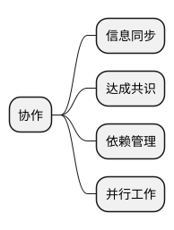

因此我们得到一个团队的成事哲学：

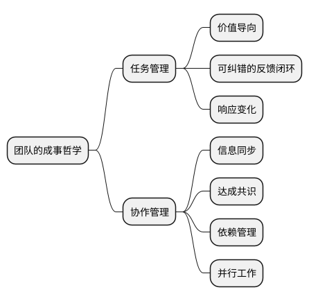

把以上成事哲学稍微整理一下就是敏捷。

## 敏捷宣言

敏捷宣言包含两部分内容：4个价值观和12条原则。

敏捷就源自敏捷宣言。

### 敏捷宣言中的4个价值观

敏捷只是成事哲学的进一步抽象。

- **个体和互动** 高于 **流程和工具**
- **工作的软件** 高于 **详尽的文档**
- **客户合作** 高于 **合同谈判**
- **响应变化** 高于 **遵循计划**


### 敏捷宣言中的12条原则

12条原则其实是4个价值观的衍生，是敏捷联盟担心人们看不懂敏捷价值观而作出的补充解释。

1. 我们最重要的目标，是通过持续不断地及早交付有价值的软件使客户满意。
1. 欣然面对需求变化，即使在开发后期也一样。为了客户的竞争优势，敏捷过程掌控变化。
1. 经常地交付可工作的软件，相隔几星期或一两个月，倾向于采取较短的周期。
1. 业务人员和开发人员必须相互合作，项目中的每一天都不例外。
1. 激发个体的斗志，以他们为核心搭建项目。提供所需的环境和支援，辅以信任，从而达成目标。
1. 不论团队内外，传递信息效果最好效率也最高的方式是面对面的交谈。
1. 可工作的软件是进度的首要度量标准。
1. 敏捷过程倡导可持续开发。责任人、开发人员和用户要能够共同维持其步调稳定延续。
1. 坚持不懈地追求技术卓越和良好设计，敏捷能力由此增强。
1. 以简洁为本，它是极力减少不必要工作量的艺术。
1. 最好的架构、需求和设计出自自组织团队。
1. 团队定期地反思如何能提高成效，并依此调整自身的举止表现。

## 敏捷方法论之Scrum

10人以下的，角色完备的小规模团队是最佳团队配置，团队越小，规矩越少，效果越高。

敏捷价值观过于抽象了，我们拿着成事哲学来看看，有哪些实践能让一个团队成事。

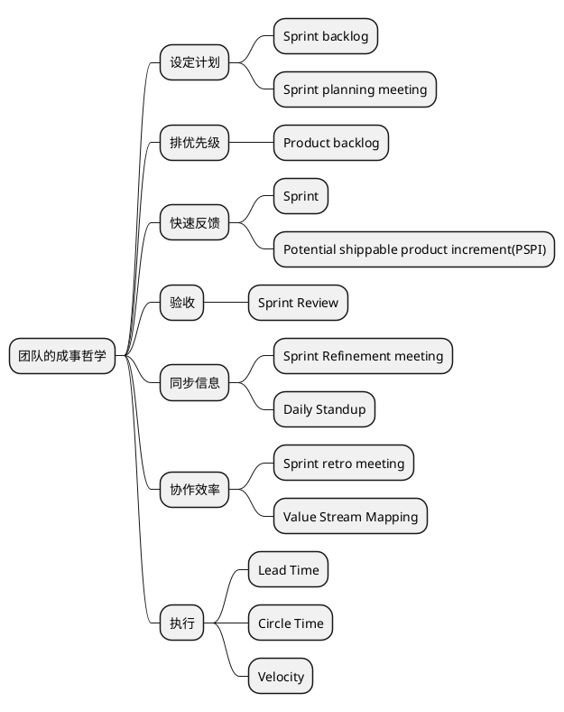

### 高效会议

会议的实践原则只有一个：让这个会议能高效地履行职责，避免浪费与会人员的时间和精力。

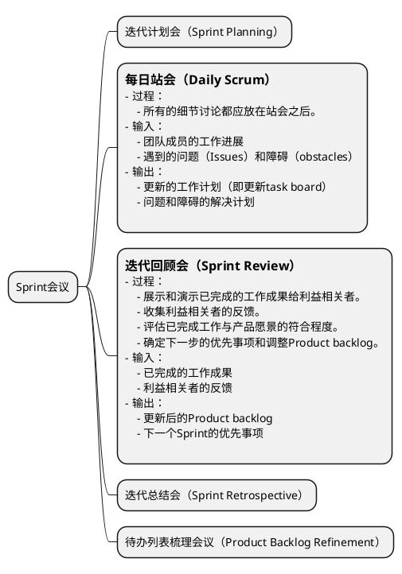

## 迭代计划会（Sprint Planning）

### 输入

- Product Backlog
- Team Velocity

### 输出

- Sprint Backlog
    - Commitment：Sprint的目标（Sprint Goal）
    - 任务的工作量估算
    - 计划（任务列表）：Todo items

## 迭代总结会（Sprint Retrospective）

### 会前准备

#### 创建Retrospective Board

> 风格：Went Well, Shoutouts, To be Improved

> 风格：Liked, Learned, Lacked, Longed For

> **Liked**
This may be the most simple. What were the positive aspects of the sprint that the team enjoyed or appreciated? This can encompass any aspect of the sprint, including actions, processes, or achievements. What went better than expected? This is all about the positive.

> **Learned**
Any good sprint includes opportunities to learn new things. Were there any new discoveries that stood out? Everything is on the table here, from technical findings to interpersonal learnings. It can be results of formal experiments or things that just bubbled to the surface.

> **Lacked**
It would be a rare event to finish a sprint and find nothing lacking. Was there something missing from the last iteration? Could something have been done better? Was there a resource lacking that would have made things run smoother?

> **Longed​ ​For​**
There is a subtle, yet essential difference between "lacked" and “longed for." In the previous category, the team identified things that they saw were missing. Now it is time to dream about things the team wished were possible, or tools they wished existed or were available to them. These are things that may or may not be possible but would improve the chances of completing a successful project.


#### 团队情绪调查（Team Sentiment Survey）

团队情绪氛围一方面会影响个体情绪和动机，从而作用于个体创造力; 另一方面 通过影响团队互动行为，对团队中个体和整体的创造力发挥影响作用。当团队情绪氛围积极时，积极情绪分享会使团队内部出现更多的扩展和开拓性互动(broadening-and-building interactions)，此类互动会 影响团队创造力、成员对团队的满意度和成员的学习，团队整体处在积极的情绪中，有利于团队成员的认知拓展和自发性提高，更愿意在他人想法上进一步提出新想法，把任务往前推进，促进团队创新绩效。

```markdown
1. How's your overall happiness for the past 2 weeks (more smiles means more happiness)

2. I find the upcoming work
    - Interesting and something to look forward to
    - OK but nothing to get excited about
    - So fun that I am looking forward to a nap

3. How challenged are you feeling about the work?
    - I am in my comfort zone, nothing in the domain challenges me at the moment
    - It's a good balance, I know my capabilities and I am expanding them through upcoming challenges
    - I feel being pushed out of my comfort zone everyday and most of the tasks involve some degree of uncertainty

4. The kind of work I find most interesting and challenging is...

5. In the past iteration I have learned new things from the team
    - Yes
    - No

6. During the past iteration, while working, I have laughed
    - Many times
    - Just a few times
    - Never. Work crushes any thought of laughter

7. Connectedness
    - I am engaged and feel connected to the team
    - It's so so...a bit hit and miss
    - I often feel isolated and on my own

8. Support
    - I feel strongly supported by people, processes, tools and resources in doing my job
    - I have just enough support to get by
    - There is little support given and I am often stuck

9. I feel confident to voice my ideas and challenge other people's opinion/approach/solution even if it is different to mine
    - Always
    - Often
    - Sometimes
    - Rarely
    - Never

10. Personal well-being
    - I have routines that create positive mental and physical health
    - I'm OK...just plodding along
    - I often feel unwell physically, mentally or both

11. I feel the work I do is recognized and appreciated
    - Yes, I feel recognized and appreciated
    - So so, it could be better
    - No, I toil in the background like a nameless cog in an ever turning machine

12. Recognition for me looks like...

13. Anything else you want to add/improve

14. What could we do next iteration to make you happier?
```

#### 过程

- 回顾和评估上一个迭代遇到的的问题、挑战和改进机会。
- 制定行动计划。
- 回顾上一次迭代总结会制定的行动计划的进展。

#### 输入

- 遇到的问题和挑战

#### 输出

- 改进行动计划（plans，**怎么做**）和承诺（commitments，**什么时候完成**）

### Product Backlog Refinement，待办列表梳理会议

#### 输入

- Product backlog

#### 输出

- 更新后的Product backlog
- 描述详细且明确的任务
- 任务的工作量估算和优先级评估

#### 过程

- 澄清需求。
- 估算工作量和确定优先级。

#### 会议职责

Refinement是加工、提炼的意思，Refinement在之前还有一个名字，叫做Grooming，后来Scrum联盟改用Refinement。在Scrum里，其实就是对下阶段的需求做一个讨论、澄清、细化的一个活动，使得团队能对后续阶段的需求能达成共识，尽量避免团队因为对需求理解的不一致所导致的各类问题，并帮助团队在下个迭代开始的时候更快进入开发状态，它一般是发生在下个迭代开始前的一段时间里。

需要注意的是，Refinement并不止在会议上发生，需求的梳理其实不仅仅只发生在每个迭代的Refinement的会议上，它其实应该是贯彻发生在整个软件开发的全过程中。只是在Refinement 会议上做了最大量的需求梳理的工作，然后从Sprint的开始，花费在需求梳理上的时间会慢慢减少，花费在软件设计开发上的时间慢慢增加，到了Sprint得后期就慢慢没有了需求方面的工作而只剩下开发上面的工作了。

整个Refinement的过程也可以简单看成发散加收敛的过程。

#### 发散

发散的意思就是在对一个story做梳理的前期，我们需要针对目标story做发散思维的讨论，尽力考虑到各个方面的问题、假设、困难，防止专家思维的局限，这是个头脑风暴的过程。

- 暂缓对别人观点的评论
- 鼓励异想天开的想法
- 可以在别人的观点上继续延伸
- 专注在story上，不要离题
- 图文并茂，鼓励使用可视化的方式
- 做加法，点子越多越好（先不关注点子的质量）

为了更好的引导这个头脑风暴的过程，我们常见的指导分析方法有：

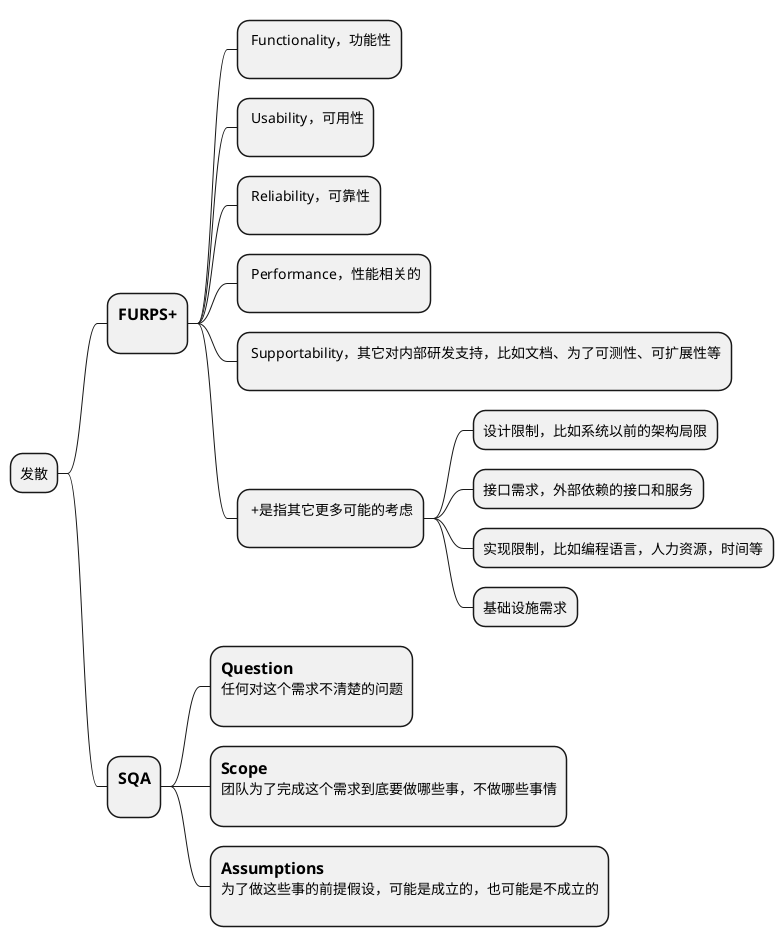

- **FURPS+** 更像一个checklist，它能提醒我们在发散的时候要从这些角度去思考，避免重大遗漏。
- **SQA** 在实际中更加常用和易用。SQA就是通过大家一起回答目标story的三个问题来澄清我们的需求。这里会有很多疑问和假设，PO需要在团队讨论的过程中随时解答团队的疑问和澄清假设，不能当场澄清的，团队和PO需要会后带回去，在下个迭代planning meeting前完成澄清。

#### 收敛

在充分发散的基础上我们就要开始收敛，这样我们才能拿到refinement最终的结果，这就是收敛的过程。为了帮助收敛，我们常用的手段有：
- 明确产出结果形式
- 投票找到公认的重点
- 时间盒

## 怎么才能做好敏捷

敏捷存在的意义不是为了让开发团队遵循敏捷，这不是敏捷的目标，只是手段。敏捷价值观和原则，敏捷的各种方法论，目标是为了能成事，只要是能成事的实践都是好的实践。

### Scrum中的各种会议是不是必须都要按时按点举行？

不是，这些会对应的目的能达成的话，如果有其他更好的形式，那完全okay，这些会甚至都可以完全取消。

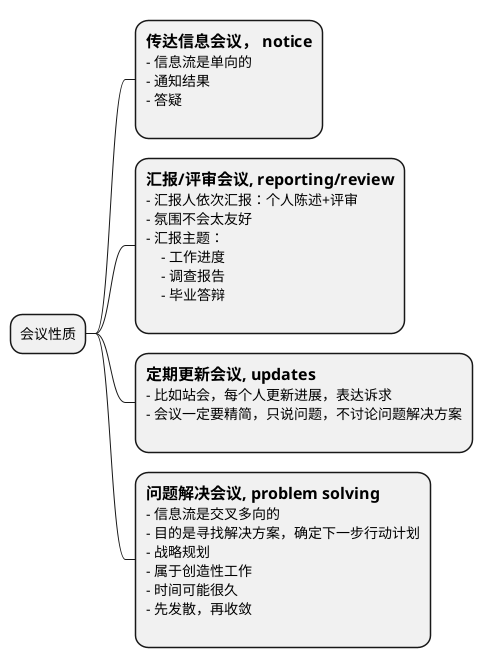

- Sprint Planning，迭代计划会 - 传达信息会议
- Daily Scrum，每日站会 - 定期更新会议
- Sprint Review，迭代回顾会 - 汇报/评审会议
- Sprint Retrospective，迭代总结会 - 问题解决会议
- Backlog Refinement，待办列表梳理会议 - 问题解决会议

相比于会议，只要有更高效且能达成相同效果的形式，那么这些会议都可以取消，会议是一种同步沟通的手段，其他的形式那可能是基于邮件/task board/即时通讯等异步沟通手段，同步和异步的差异其实就是会议特有的另外一个功能：会议是可以现场收集到所有与会人员确认信息被收到并理解的回执的，就如同你发了一个短信有短信回执一样，作为会议的主持人你能确切地从与会者参会的表现获得他收到信息的证据。

- 团队人数过多（>10）的时候，这种回执的效果会变的很差，这个时候全员会议应该尽可能少，应该依赖异步沟通+强有力的task board management来完成。
- 当团队人数过少（<=3）的时候，沟通效率很高，因此会议应该尽量少。
- 凡是需要团队外部参与的会议，不应该被轻易取消。
- 所有的会议应该只邀请必要的与会人员。

### 产品的需求稳定不变，有必要采用敏捷吗？

### 如何提高组织对敏捷的认知

- 对于团队内非管理岗位的成员，敏捷的认知普及要教条一些，以遵循实践原则为主。
- 对于管理岗位的成员，敏捷的认知要进阶，要学会知其本源灵活应用。

### 大型组织内如何实践敏捷

怎么算是大型组织？规模在100人以上的团队都算作大型组织。

#### 依赖管理

#### 需求管理

#### 组织拓扑

### 如何评估一个组织的敏捷程度

#### 敏捷成熟度模型（Agile Maturity Model）

业内有很多敏捷成熟度模型的定义，即从多个维度分别进行打分。

#### 价值流图

价值流图的作用主要是为了在评估过程中帮助梳理团队的工作流，并识别出痛点，类似的，在特斯拉，马斯克要求流水线上每个环节必须有对应时长的显式，这样可以持续的看到在哪个环节耗时比较久，进行改进生产线。

#### 评估手段

- 观察
- 访谈
