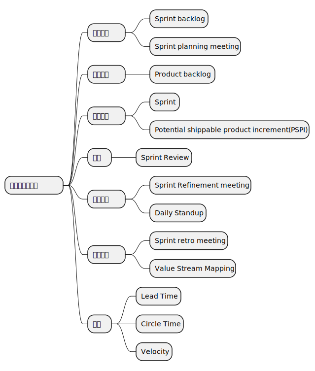
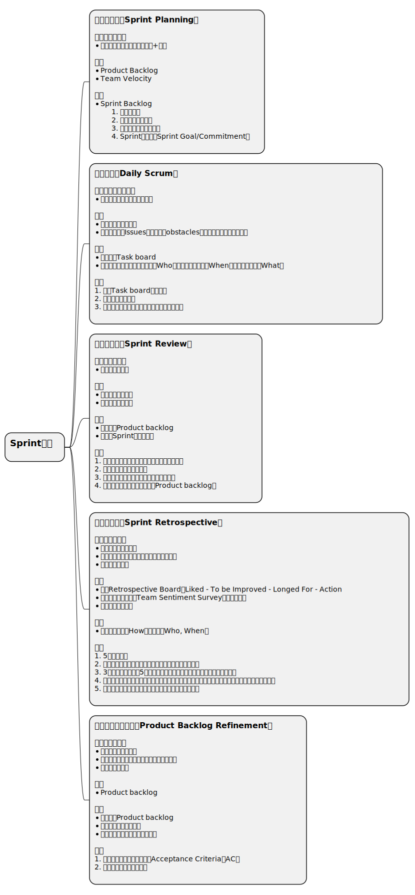

## 敏捷方法论之Scrum

* 底层思维
    * 精益思维
    * 经验主义

> 经验主义是指根据实际经历的事情来做决定的行为。经验主义方法意味着以事实为基础，以经验为基础，以证据为基础的方式工作，特别是进展是基于对现实的观察，而不是基于大量的前期要求的虚构计划。

比如你自己每天有todo list，这就是一个大的计划
敏捷中提到了很多点，敏捷的思想是适合于全天下所有的项目的，只是不同的项目在应用敏捷时侧重点不同。火箭就不能快速验证，软件结合的如何敏捷，要求一个项目全面敏捷是教条主义。

敏捷本身只是一组价值观和原则，符合价值观和原则的实践都属于敏捷方法论（Agile methodology）。

> Scrum is founded on empiricism and lean thinking. Empiricism asserts that knowledge comes from experience and making decisions based on what is observed. Lean thinking reduces waste and focuses on the essentials. 
> -- [Scrum Guide](https://scrumguides.org/scrum-guide.html)

所谓Sprint Backlog，就是任务列表，列表代表着有序，有序代表着优先级不同，因此设定好优先级的任务列表就是迭代计划。

### 高效会议

低效会议的表现：
- 迟到
- 各说各的

要想高效的会议，主持会议的人就需要做充分的准备，团队越大，准备工作就越需要重视，不然会议决然无法高效。

Refinement是加工、提炼的意思，Refinement在之前还有一个名字，叫做Grooming，后来Scrum联盟改用Refinement。在Scrum里，其实就是对下阶段的需求做一个讨论、澄清、细化的一个活动，使得团队能对后续阶段的需求能达成共识，尽量避免团队因为对需求理解的不一致所导致的各类问题，并帮助团队在下个迭代开始的时候更快进入开发状态，它一般是发生在下个迭代开始前的一段时间里。

Refinement并不止在会议上发生，需求的梳理其实不仅仅只发生在每个迭代的Refinement的会议上，它其实应该是贯彻发生在整个软件开发的全过程中。只是在Refinement 会议上做了最大量的需求梳理的工作，然后从Sprint的开始，花费在需求梳理上的时间会慢慢减少，花费在软件设计开发上的时间慢慢增加，到了Sprint得后期就慢慢没有了需求方面的工作而只剩下开发上面的工作了。

整个Refinement的过程也可以简单看成发散加收敛的过程。

发散就是针对story做发散思维的讨论，尽力考虑到各个方面的问题、假设、困难，防止专家思维的局限，这是个头脑风暴的过程。
PO和架构师需要在团队讨论的过程中随时解答疑问，不能当场澄清的，PO需要会后带回去，在迭代计划会前完成澄清。

问题应该是多角度的：
- 功能性的需求（Functional Requirement，FR）
- 跨功能需求（Cross-Functional Requirements，CFR）/ 非功能性需求（Non-functional requirement，NFR）：可测试性，可维护性，可用性，兼容性，性能，稳定性

在充分发散的基础上就可以开始收敛，明确验收标准（Acceptance Criteria，AC）。

## 怎么才能做好敏捷

敏捷存在的意义不是为了让开发团队遵循敏捷，这不是敏捷的目标，只是手段。敏捷价值观和原则，敏捷的各种方法论，目标是为了能成事，只要是能成事的实践都是好的实践。

### Scrum中的各种会议是不是必须都要按时按点举行？

不是，这些会对应的目的能达成的话，如果有其他更好的形式，那完全okay，这些会甚至都可以完全取消。

相比于会议，只要有更高效且能达成相同效果的形式，那么这些会议都可以取消，会议是一种同步沟通的手段，其他的形式那可能是基于邮件/task board/即时通讯等异步沟通手段，同步和异步的差异其实就是会议特有的另外一个功能：会议是可以现场收集到所有与会人员确认信息被收到并理解的回执的，就如同你发了一个短信有短信回执一样，作为会议的主持人你能确切地从与会者参会的表现获得他收到信息的证据。

- 团队人数过多（>10）的时候，这种回执的效果会变的很差，这个时候全员会议应该尽可能少，应该依赖异步沟通+强有力的task board management来完成。
- 当团队人数过少（<=3）的时候，沟通效率很高，因此会议应该尽量少。
- 凡是需要团队外部参与的会议，不应该被轻易取消。
- 所有的会议应该只邀请必要的与会人员。

### 产品的需求稳定不变，有必要采用敏捷吗？

### 如何提高组织对敏捷的认知

- 对于团队内非管理岗位的成员，敏捷的认知普及要教条一些，以遵循实践原则为主。
- 对于管理岗位的成员，敏捷的认知要进阶，要学会知其本源灵活应用。

### 大型组织内如何实践敏捷

怎么算是大型组织？规模在100人以上的团队都算作大型组织。

#### 依赖管理

#### 需求管理

#### 组织拓扑

### 如何评估一个组织的敏捷程度

#### 敏捷成熟度模型（Agile Maturity Model）

业内有很多敏捷成熟度模型的定义，即从多个维度分别进行打分。

#### 价值流图

价值流图的作用主要是为了在评估过程中帮助梳理团队的工作流，并识别出痛点，类似的，在特斯拉，伊隆·马斯克要求流水线上每个环节必须有对应时长的显式，这样可以持续的看到在哪个环节耗时比较久，进行改进生产线。

#### 评估手段

- 观察
- 访谈

### 六西格玛工具

“六西格玛流程”来源于，如果人们在流程平均值和最近的规格界限之间达到了六个标准方差，如图所示，就不会有残次品。[12]这是根据流程效能研究中的计算获得的。

质量管理
### FMEA

### 为什么会有retro，retro上为什么需要敏捷宣言

正面意义上，是为了团队的持续改进和提高。
负面意义上，是为了防止群体降智的发生。
参考：
    https://www.allhistory.com/article/5e68cd45a4188f0001973433
原因：
    - 群体内部的人们互相影响，容易情绪化，进而独立思考能力下降，倾向于接受简单、冲动的想法。
    - 群体中各成员思维存在差异。相对迟钝的成员，提出一个建议，其他成员不好意思反对，结果就是群体的智商看起来降低了。另一方面，迟钝的成员理解不了敏锐者的想法，甚至出来反对，决策效率就会受到限制。
    - 群体内压力会迫使成员从众以避免被边缘化。
    - 为了维护群体凝聚力或共同目标，成员提出不同意见的意愿会降低，容易做出不合理的决策。如果有投票的程序，还会把不合理的决定合理化。
    - 群体存在隐形的阶级，上级的权威限制下级的思维。个体在一个分工不明确的集体中时，会推卸责任，说白了，就是觉得自己没有思考的责任，所以开始随大流，然后下级降智，上级狂妄，酿成悲剧。
案例：
    - 猪湾事件
        美国帮助古巴流亡者登陆猪湾的计划失败，令肯尼迪威信受损，而且到现在还被认为是美国军事、政治史上的污点。中情局给出的行动计划漏洞百出，比如选择的疏散地点，距离任务地150公里，且隔着一大片沼泽，徒步根本无法到达。商讨后，肯尼迪总统和他的顾问们却一致通过了这个计划，因为这是肯尼迪就任后第一项重大军事行动，对成功的一致渴望让群体内形成互相暗示，不再表达不同意见，从而做出了愚蠢的决定。
    - 几个劫匪劫了一大群人，劫匪让人们交钱，第一个人交一百，第二个人交两百……以此类推。第一个交钱的人向别人炫耀自己交的钱最少，于是这一大群人都只顾抢着交钱，而忘了反抗。
解决方法；
    - 对一个团队来说，不同观点的碰撞有时候比达成共识更重要。
    - 在一个包容的环境中，群体成员畅所欲言，自然不会失去理性。和勒庞同时代的社会学家塔尔德认为，群体内部有讨论、对话，形成有效的互动，那么这个群体就不会变得盲目冲动。
    - 适当引入外部的评价也有利于避免群体智力下降。 -- 这一点也是为什么需要敏捷评估的原因之一。
